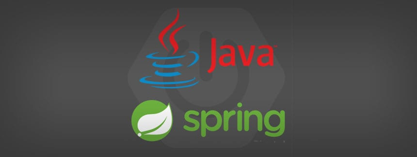
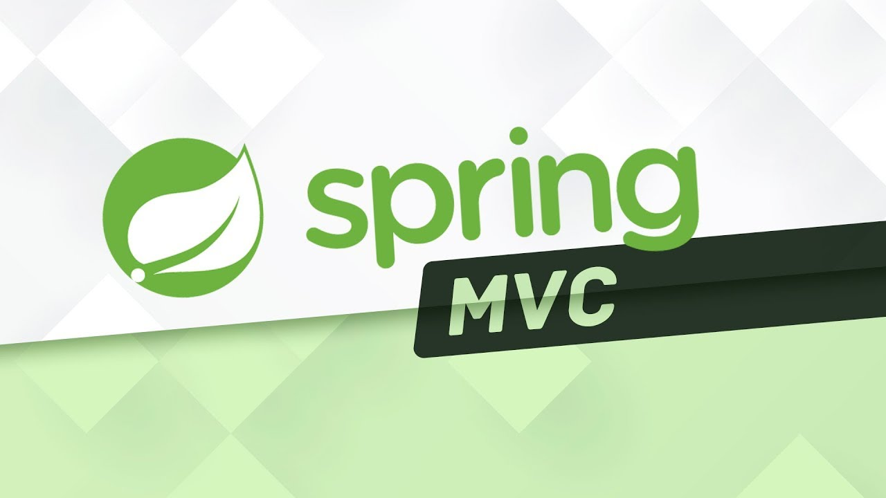

# spring-boot-tutorials-demos
Bir ton videolu kurs izliyorum. Kendimi çok geliştirmek istiyorum. Gelişmek için bir ton örnek yapıyorum. Bütün yaptığım kodları buraya işleyeceğim(commit + push).

##### Spring Nedir?
Spring nedir?
Spring Framework nedir?

Birden fazla tanım yapmak istiyorum.

Tanım 1: Spring, kurumsal üretime hazır uygulama oluşturmak için oluşturulmuş bir Java web çerçevesidir.

Tanım 2: Spring, Spring Source topluluğu tarafından Java programcıları için üretilmiş açık kaynak kodlu çeşitli yazılım çözümlerini içinde barındıran, dev bir ekosistem ve framework / çatıdır.

Bir Java kurumsal uygulaması oluşturduğumuzda bir çok konfigürasyon yapmamız gerekiyor, jar’lar eklememiz gerekiyor ve ayrıca veri tabanı desteğini de eklememiz gerekiyor.
Spring, birçok şeyi yapmamıza izin verecek Java web çerçevesidir. Spring, çeşitli konfigürasyonlar için bir grup modül sağlar, bu modülleri uygulamamızı oluşturmak için kullanabiliriz. Ancak tüm bu modülleri kullanmak için, uygulamayı kurmak ve çalıştırmak için birçok yapılandırma yapmamız gerekiyor.
Uzun lafın kısası, Spring çerçevesi üretime hazır uygulama oluşturmamıza yardımcı oluyor, ancak çok fazla yapılandırma yapmamız gerekiyor.

Spring’in ilk çıkış amacı projenin katmanları arası bağımsızlığı yahut gevşek bağlar kurma amaçlıydı. Daha sonradan dev bir ekosistem haline geldi. Spring yokken EJB(Enterprice Java Bean) vardı. Ancak EJB’nin kullanım şekli çok zordu. Hiç pratik değildi ve insanlar kullanmakta zorlanıyorlardı. EJB çok güçlü olmasına rağmen kullanımı çok zordu. Daha sonra Spring çıktı. Spring EJB’ye göre oldukça kolay konfigurasyon ve kullanım şekli sunuyordu. Kalite ve güç olarak EJB kadar iyiydi. Hem kaliteli hemde kolay kullanım sunduğu için insanlar Spring’i tercih ettiler ve Java dünyasının Defacto Standartı oluverdi.

Java Dünyasında Standart nedir?

Standart, Java’nın sahibi olan Oracle firması tarafından üretilmiş orijinal Java alt teknolojileridir.

Java Dünyasında Defacto Standart nedir?

Java’nın sahibi olan Oracle firması tarafından üretilmeyip farklı firmalar tarafından üretilip Standart olan teknolojiden bile çok fazla piyasada tutulup halk tarafından kabul gören teknolojiye Java dünyasında Defacto Standart deniliyor.

Spring Boot nedir?

Spring Boot, Spring Team tarafından hızlı ve kolay bir şekilde Spring tabanlı uygulamalar oluşturmak için sunulan bir araçtır. Sıfırdan otomatik yapılandırma / konfigurasyon desteği sağlar. Konfigürasyona odaklanmak yerine sadece gerçek iş mantığına odaklanabiliriz.
Spring boot bir çerçeve değil, Spring tabanlı uygulamalar oluşturmak için bir araç veya uzantıdır. Spring Boot dahili olarak Spring’i kullanır. Yani aslında bildiğimiz Spring Framework’ün güncellenmiş / modernize edilmiş / otomatize edilmiş / XML konfigurasyonlarından arındırılmış ve notasyon bazlı hale getirilmiş pratik halidir.

Neden Spring Boot kullanmalıyız?

Hızlı uygulama geliştirme ve yayına alma / deploying.
Bağımlılıkları yönetme / dependency management.
Otomatik yapılandırma desteği / auto configuration.
Dağıtık sunucular için destek / disturbuted server support.
Mikro hizmetler / Microservices oluşturma desteği / microservices creating support.
Invertion of Control / IoC / Kontrolün Tersine Çevrilmesi ve Bağımlılık Enjeksiyonu / Bağımlılıkların Enjekte Edilmesi / Dependency Injection :

Tipik Java uygulamalarında geliştirici olarak Java nesneleri new’leyerek kendimiz elle / manuel olarak yaratırız. Ancak kurumsal projelerde uygulamalarla çalışırken bu iyi bir fikir değil. Çünkü nesneleri elle yaratmak, yok etmek ve yaşam döngülerini yönetmek kolay değil. Böylece nesneleri elle yaratmak yerine, nesnelerin yaşam döngüsünü yönetmesi için çerçeveye / framwork’e denetim veriyoruz. Buna IoC(Inversion of Control) kontrolün tersine çevrilmesi yani nesnelerin kontrolünün Spring’in kabına bırakılması da denilebilir.

Spring Container ve yönetilen nesneler temsili resim:

IoC(kontrolü tersine çevirme)’yi kullanmak için, DI((Dependency Injection)bağımlılık enjeksiyonunu) kullanmamız gerekir; bu, new anahtar kelimesini kullanmadan Java nesneleri oluşturmamıza izin verecek bir tasarım modelidir.
Spring Boot uygulaması çalıştığında, Spring’in bir fabrika nesnesi veya konteyneri vardır, bizim için Bean(fasulye / kahve çekirdeği / aslında Spring tarafından yönetilen Java nesnesi) oluşturur, daha sonra belirli bir Bean(Spring’in yönettiği Java nesnesi) istediğimizde, önce konteyneri kontrol eder, eğer varsa, daha önce oluşturulmuş nesnenin bellek referansını yani bellek adresini verir, aksi takdirde bizim için yeni nesneler yaratır.

Spring Boot projesini nasıl oluşturulur?

Spring ekibi, Spring Boot başlangıç ​​projesi oluşturmak için çevrimiçi bir web aracı sağlar. Spring başlatıcı aracını bu URL’de bulabilirsiniz https://start.spring.io/
Spring boot projesi oluşturmak için tek yapmanız gereken proje detaylarını, Spring Boot sürümünü girmek ve bağımlılıkları eklemek ve generate / üret butonuna basmak.

---

#### Spring MVC Nedir?

Spring MVC, Java’da web uygulamaları oluşturmak için bir framework / çerçeve / çatı) dır.
• Model / View / Controller(Model-Görünüm-Kontrol) tasarım şablonuna dayalıdır.
• Kontrolün tersine çevrilmesi ve bağımlılık enjeksiyonu gibi temel Spring çerçevesinin özelliklerinden yararlanır.
Model / View / Controller(Model-Görünüm-Denetleyici) nedir?

MVC bir tasarım desenidir ancak bir katmanlı mimari değildir. Herhangi bir yazılım firmasına ait değildir. Tüm yazılımcılar arasında kabul görmüş ve kullanılan ortak bir tasarım şablonudur. Spring MVC, MVC tasarım şablonuna göre yazılmış bir çatı / framework’dür.

İsteği / request’i ilk alan yer front controller / ön kontrolcüdür. Ön kontrolcü isteği aldıktan sonra ilgili kontrolcüye gönderir. İlgili kontrolcü isteği aldıktan sonra servis katmanına, servis katmanı ise veri erişim katmanına gider. Veri erişim katmanı veri tabanından verileri çeker getirir. Kontrolcü veriyi elde ettikten sonra ilgili verileri model nesnesinin içine koyar ve o modeli görünümün yani view’in içine gömer. İlgili view kullanıcıya html(hyper text markup language) olarak döner.

View ile Controller arasında taşınan nesne aslında Model nesnesidir.

Client tarafından gelen form nesnesi de aslında model nesnesidir.

Model aslında Controller ile View arasında iletişim sağlayan nesnedir.

Controller GET, POST, PUT, DELETE, PATCH gibi HTTP isteklerini karşılayan nesnedir / yapıdır.

View yapısı Chrome, Firefox yada Opera gibi Web tarayıcılarda gösterilen HTML(Hyper Text Markup Language) dosyasıdır. İçerisinde JS / Java Script, CSS / Cascading Style Sheet, JQuery gibi yapılar barındırabilir.

Spring MVC’nin mimarisinin akış şeması aşağıdadır:

Tarayıcı, sunucuya bir istek gönderir. Sunucu bu isteği alır, işler ve Ön denetleyiciye(Dispatcher Servlet) gönderir.
• Ön denetleyicinin ismi Dispatcher Servlet’tir, görevi, isteği / request ilgili denetleyiciye göndermektir.
• İlgili denetleyici kodu, geliştiriciler tarafından yazılan ve iş mantığını içeren koddur.
• Denetleyici daha sonra modeli hazırlayacak ve sonraki işlemler için Ön denetleyiciye gönderecektir.
• Ön denetleyici daha sonra bu modeli, web sayfasında görüntülenmesi gereken HTML kodunu ve verileri içeren görünüm şablonuna gönderir.

Denetleyici / Kontrolcü / Controller:

Denetleyici sınıfları, geliştiriciler tarafından oluşturulur.
• İş mantığını içerir ve isteği işler.
• Veri tabanından ve diğer hizmetlerden veri depolar ve alır.
• Verileri modelin içine koyar ve modeli de View / HTML’nin içine koyar.
Model:

• Model, yalnızca verileri içeren bir java nesnesidir.
• Veri tabanından veya web hizmetinden verileri depolamamıza ve almamıza yardımcı olacaktır.

View — Şablon Motorları / Template Engine:

Spring MVC esnektir, şablon motorunu destekler.
• En sık kullanılan şablon motorları JSP ve Thymeleaf’tir.
• Geliştirici, Model’de bulunan verileri görüntülemek için görünüm şablonunu oluşturur.

Spring MVC Faydaları:

Java’da web uygulamaları oluşturmanın en iyi ve en popüler yoludur.
• Bir ton yeniden kullanılabilir UI / User Interface / kullanıcı arayüzü bileşeninden yararlanır.
• Web istekleri / web request için uygulama durumunu yönetmemize yardımcı olur.
• Form verilerini doğrulayarak, dönüştürerek işler / elden geçirir.
Bu makale için bu kadar, beğendiyseniz lütfen arkadaşlarınız ve meslektaşlarınızla paylaşın ve ayrıca bunu sosyal medya profillerinizde paylaşınız.
