**1. Spring Boot'a Giriş**


**Spring Boot Nedir?**

Spring Boot, Java dünyasının en popüler framework'lerinden biri olan Spring'in, geliştiricilere hızlı ve pratik bir şekilde proje oluşturma imkanı sunan bir alt yapısıdır. 🚀 Yani, Spring Boot olmadan bir Spring projesi kurmak, bir evi sıfırdan inşa etmek gibidir. Temeli atarsın, duvarları örersin, çatıyı çakarsın derken bir bakmışsın projenin başlangıcı bile bitmemiş. Ama Spring Boot ile bu iş, hazır bir ev satın alıp içini döşemek kadar kolay hale gelir. 😊 Spring Boot, özellikle mikroservisler ve modern web uygulamaları geliştirmek isteyenler için biçilmiş kaftandır. Hem hızlı hem de esnek bir yapı sunar, bu da onu özellikle startup'lardan büyük kurumsal firmalara kadar herkesin gözdesi yapar.

Spring Boot'un en büyük özelliği, "convention over configuration" yani "yapılandırma yerine kural" prensibini benimsemesidir. Bu ne demek oluyor? Mesela, geleneksel Spring'te bir web uygulaması geliştirmek için tonla XML dosyası yazman gerekir. Ama Spring Boot'ta bu işlemler otomatik olarak halledilir. Sen sadece kodunu yazarsın, gerisini Spring Boot halleder. 🎉


**Spring Boot'un Avantajları ve Kullanım Alanları**

Spring Boot'un en büyük avantajı, hızlı ve kolay bir şekilde proje geliştirmene olanak sağlamasıdır. Özellikle:

Otomatik yapılandırma sayesinde, uğraşman gereken tonla XML dosyasından kurtulursun. 🎉 Mesela, bir veritabanı bağlantısı kurmak için saatlerce uğraşmana gerek yok. Spring Boot, senin yerine bu işi halleder.

Gömülü sunucu desteğiyle, uygulamanı tek bir JAR dosyası olarak paketleyip çalıştırabilirsin. Yani Tomcat'i ayrıca kurmana gerek yok! Uygulamanı çalıştırdığında, Spring Boot otomatik olarak gömülü sunucuyu başlatır.

Production-ready özellikleri sayesinde, uygulamanı canlıya aldığında sağlık kontrolü (health check), metrikler ve daha birçok şey hazır olur. Yani, uygulamanın sağlığını anlık olarak izleyebilirsin.

**Spring Boot, özellikle:**

RESTful API'ler geliştirmek,

Mikroservis mimarisi oluşturmak,

Veritabanı entegrasyonu yapmak,

Bulut tabanlı uygulamalar geliştirmek için kullanılır.


Mesela, bir e-ticaret sitesi yapıyorsun diyelim. Ürünleri listeleyen bir API, kullanıcı girişi için bir auth servisi, siparişleri takip eden bir servis... Bunların hepsini Spring Boot ile kolayca geliştirebilirsin. Hem de her birini ayrı ayrı mikroservis olarak yazıp, birbirinden bağımsız çalıştırabilirsin. 🛒

**Spring Boot ile Geleneksel Spring Framework Arasındaki Farklar**

Spring Framework, Java dünyasının en güçlü framework'lerinden biridir. Ancak, Spring Boot olmadan bir Spring projesi kurmak, biraz zahmetli olabilir. 🥱 Spring Boot, Spring Framework'ün üzerine inşa edilmiş bir katmandır ve şu farklara sahiptir:

**Yapılandırma:** Spring'te tonla XML dosyası yazman gerekirken, Spring Boot'ta bu işlem otomatiktir. Mesela, bir veritabanı bağlantısı için XML'de bir sürü satır yazman gerekir. Ama Spring Boot'ta sadece application.properties dosyasına birkaç satır eklemen yeterli.

**Başlangıç Hızı:** Spring Boot, projeyi hızlıca ayağa kaldırmanı sağlar. Spring'te ise her şeyi sıfırdan ayarlaman gerekir. Özellikle yeni başlayanlar için bu çok zorlayıcı olabilir.

**Gömülü Sunucu:** Spring Boot'ta Tomcat, Jetty gibi sunucular hazır gelir. Spring'te bunları manuel olarak yapılandırman gerekir. Yani, Spring Boot ile uygulamanı tek bir JAR dosyası olarak paketleyip, herhangi bir sunucuya ihtiyaç duymadan çalıştırabilirsin.

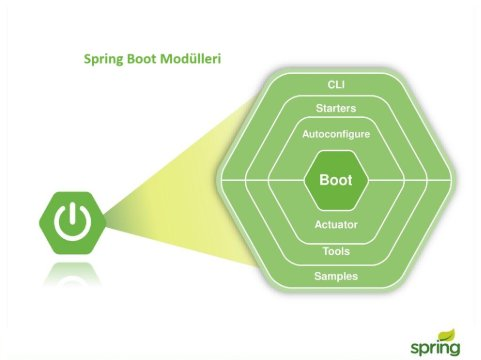

**Spring Boot'un Tarihçesi ve Gelişimi**

Spring Boot, ilk olarak 2014 yılında piyasaya sürüldü. 🎂 O günden bu yana, Java geliştiricilerinin hayatını kolaylaştırmak için sürekli gelişti. Spring Boot 1.x sürümleriyle başlayan yolculuk, 2.x sürümleriyle daha da olgunlaştı. Özellikle Spring Boot 2.0 ile birlikte, reactive programming ve daha iyi performans özellikleri geldi. Şimdilerde ise Spring Boot 3.x sürümleriyle birlikte, Java 17 ve Jakarta EE 9 gibi yeni teknolojilere tam destek veriyor. 🌟

Spring Boot'un bu kadar hızlı benimsenmesinin bir nedeni de, topluluk desteğinin çok güçlü olmasıdır. Herhangi bir sorunla karşılaştığında, Stack Overflow'da veya Spring'in resmi forumlarında binlerce çözüm bulabilirsin. Ayrıca, Spring Boot'un sürekli güncellenmesi ve yeni özellikler eklenmesi, onu her zaman güncel tutuyor.


**2. Spring Boot'un Temel Özellikleri**

Spring Boot, geliştiricilere birçok hazır özellik sunar. Bu özellikler sayesinde, uygulama geliştirme süreci hem hızlanır hem de daha keyifli hale gelir. Şimdi bu özellikleri tek tek inceleyelim. 😎

**Otomatik Yapılandırma (Auto-configuration)**

Spring Boot'un en sevdiğim özelliklerinden biri, otomatik yapılandırma (auto-configuration) özelliğidir. Bu özellik sayesinde, uygulamanın çalışması için gerekli olan birçok yapılandırma otomatik olarak halledilir. Mesela, bir veritabanı bağlantısı kurmak istiyorsun. Spring Boot, classpath'te H2 veya MySQL gibi bir veritabanı driver'ı gördüğünde, otomatik olarak gerekli yapılandırmayı yapar. Sen sadece application.properties dosyasına birkaç satır eklemen yeterli. İşte basit bir örnek:

```java
/*
@author Huseyin_Aydin
@since 1994
@category Java, Spring Boot.
*/

@SpringBootApplication
public class MyApp {
    public static void main(String[] args) {
        SpringApplication.run(MyApp.class, args);
    }
}
```

Bu kadar! Spring Boot, geri kalan her şeyi otomatik olarak halledecek. 🎉

**Bağımsız Çalışabilme (Stand-alone)**

Spring Boot uygulamaları, bağımsız olarak çalışabilir. Yani, uygulamanı bir JAR dosyası olarak paketleyip, herhangi bir sunucuya ihtiyaç duymadan çalıştırabilirsin. Bu özellik, özellikle mikroservis mimarilerinde çok işe yarar. Uygulamanı tek bir komutla çalıştırabilirsin:

java -jar myapp.jar

**Gömülü Sunucu Desteği (Embedded Server: Tomcat, Jetty, Undertow)**

Spring Boot, gömülü sunucu desteği sayesinde, uygulamanı tek bir JAR dosyası olarak paketleyip çalıştırmanı sağlar. Yani, Tomcat veya Jetty gibi bir sunucuya ihtiyaç duymazsın. Spring Boot, varsayılan olarak Tomcat'i kullanır, ancak istersen Jetty veya Undertow gibi diğer sunucuları da kullanabilirsin. İşte nasıl yapılandırabileceğine dair bir örnek:

```java
@SpringBootApplication
public class MyApp {
    public static void main(String[] args) {
        SpringApplication.run(MyApp.class, args);
    }
}
```

Eğer Jetty kullanmak istersen, pom.xml dosyasına şu bağımlılığı eklemen yeterli:

```xml
<dependency>
    <groupId>org.springframework.boot</groupId>
    <artifactId>spring-boot-starter-jetty</artifactId>
</dependency>
```

**Production-ready Özellikler (Actuator, Health Checks, Metrics)**

Spring Boot, production ortamlarında kullanılmak üzere birçok hazır özellik sunar. Bunların başında Actuator gelir. Actuator sayesinde, uygulamanın sağlık durumunu, metriklerini ve diğer birçok bilgiyi kolayca izleyebilirsin. Actuator'u kullanmak için, pom.xml dosyasına şu bağımlılığı eklemen yeterli:

```xml
<dependency>
    <groupId>org.springframework.boot</groupId>
    <artifactId>spring-boot-starter-actuator</artifactId>
</dependency>
```

Actuator'u ekledikten sonra, uygulamanın sağlık durumunu şu şekilde kontrol edebilirsin:

```bash
curl http://localhost:8080/actuator/health
```

Bu komut, uygulamanın sağlık durumunu JSON formatında dönecektir. Örneğin:

```json
{
  "status": "UP"
}
```

**3. Spring Boot Projesi Oluşturma**

Spring Boot ile proje oluşturmak, artık birkaç tıklamayla halledilebilecek kadar kolay. 🎉 Özellikle Spring Initializr gibi araçlar sayesinde, bir Spring Boot projesini sıfırdan oluşturmak sadece birkaç dakika sürer. Şimdi bu süreci adım adım inceleyelim ve birkaç örnekle pekiştirelim. 😎

**Spring Initializr Kullanarak Proje Oluşturma**

Spring Initializr, Spring Boot projeleri oluşturmak için kullanılan harika bir araçtır. Hem web arayüzü hem de IDE'ler (IntelliJ IDEA, Eclipse gibi) üzerinden kullanılabilir. Ben genelde web arayüzünü kullanmayı tercih ediyorum çünkü daha pratik geliyor. İşte adım adım nasıl yapılacağı:

Spring Initializr sitesine git: <https://start.spring.io/>

Project alanında Maven Project veya Gradle Project seç. Ben Maven kullanmayı tercih ediyorum çünkü daha alışkınım. 😊

Language olarak Java seç.

Spring Boot sürümünü seç. Genelde en son sürümü kullanmak en iyisidir.

Project Metadata alanında, grup adı (Group) ve proje adı (Artifact) gir. Mesela, grup adı com.huseyinaydin, proje adı myapp gibi olabilir.

Dependencies alanında, projende kullanmak istediğin bağımlılıkları ekle. Mesela, Spring Web, Spring Data JPA, H2 Database gibi bağımlılıklar ekleyebilirsin.

Generate butonuna tıkla ve projeni indir.

İndirdiğin zip dosyasını açıp, favori IDE'ne import edebilirsin. Ben IntelliJ IDEA kullanıyorum, o yüzden onun üzerinden devam edeceğim. 😊

**Maven ve Gradle ile Proje Yapılandırması**

Spring Boot projeleri, genelde Maven veya Gradle ile yönetilir. Ben Maven kullanmayı tercih ediyorum çünkü XML yapılandırmasına daha alışkınım. Ama Gradle da oldukça popüler, özellikle daha modern bir yapı istiyorsan Gradle'ı tercih edebilirsin. İşte bir Maven pom.xml örneği:


```xml
<project xmlns="http://maven.apache.org/POM/4.0.0"
         xmlns:xsi="http://www.w3.org/2001/XMLSchema-instance"
         xsi:schemaLocation="http://maven.apache.org/POM/4.0.0 http://maven.apache.org/xsd/maven-4.0.0.xsd">
    <modelVersion>4.0.0</modelVersion>
    <groupId>tr.com.huseyinaydin</groupId>
    <artifactId>myapp</artifactId>
    <version>1.0.0</version>
    <parent>
        <groupId>org.springframework.boot</groupId>
        <artifactId>spring-boot-starter-parent</artifactId>
        <version>3.1.0</version>
        <relativePath/>
    </parent>
    <dependencies>
        <dependency>
            <groupId>org.springframework.boot</groupId>
            <artifactId>spring-boot-starter-web</artifactId>
        </dependency>
        
        <dependency>
            <groupId>org.springframework.boot</groupId>
            <artifactId>spring-boot-starter-data-jpa</artifactId>
        </dependency>

        <dependency>
            <groupId>com.h2database</groupId>
            <artifactId>h2</artifactId>
            <scope>runtime</scope>
        </dependency>
    </dependencies>

    <build>
        <plugins>
            <plugin>
                <groupId>org.springframework.boot</groupId>
                <artifactId>spring-boot-maven-plugin</artifactId>
            </plugin>
        </plugins>
    </build>
</project>

Bu pom.xml dosyası, temel bir Spring Boot projesi için gerekli olan bağımlılıkları içerir. Spring Web RESTful web servisleri oluşturmak için, Spring Data JPA veritabanı işlemleri için, H2 Database ise hafif bir veritabanı olarak kullanılır. 🛠️

**Temel Bir Spring Boot Uygulamasının Yapısı ve Bileşenleri**

Spring Boot projesi oluşturduğunda, temel olarak şu dizin yapısıyla karşılaşırsın:

```
src
├── main
│   ├── java
│   │   └── com
│   │       └── huseyinaydin
│   │           └── myapp
│   │               ├── MyAppApplication.java
│   │               ├── controller
│   │               │   └── MyController.java
│   │               ├── service
│   │               │   └── MyService.java
│   │               └── repository
│   │                   └── MyRepository.java
│   └── resources
│       ├── application.properties
│       └── static
│       └── templates
└── test
    └── java
        └── com
            └── huseyinaydin
                └── myapp
                    └── MyAppApplicationTests.java
```

**Bu yapıda:**

**MyAppApplication.java:** Uygulamanın başlangıç noktasıdır. @SpringBootApplication annotation'u ile işaretlenir.

**MyController.java:** RESTful web servislerinin yazıldığı katmandır.

**MyService.java:** İş mantığının (business logic) yazıldığı katmandır.

**MyRepository.java:** Veritabanı işlemlerinin yapıldığı katmandır.

İşte basit bir Spring Boot uygulaması örneği:

```java
@SpringBootApplication
public class MyAppApplication {
    
    public static void main(String[] args) {
        SpringApplication.run(MyAppApplication.class, args);
    }
}

@RestController
@RequestMapping("/api")
public class MyController {
    
    @GetMapping("/hello")
    public String sayHello() {
        return "Merhaba, Spring Boot! 🚀";
    }
}
```

Bu uygulamayı çalıştırdığında, tarayıcıdan http://localhost:8080/api/hello adresine giderek "Merhaba, Spring Boot! 🚀" mesajını görebilirsin. Ne kadar kolay değil mi? 😊

**4. Spring Boot'ta Bağımlılık Yönetimi**

Spring Boot, bağımlılık yönetimi konusunda gerçekten çok başarılı bir iş çıkarıyor. 🎉 Özellikle Spring Boot Starter'ları sayesinde, projene eklemek istediğin bağımlılıkları tek bir satırla ekleyebilirsin. Bu, hem zaman kazandırır hem de bağımlılık çakışmalarını önler. Şimdi bu konuyu detaylı bir şekilde inceleyelim ve birkaç örnekle pekiştirelim. 😎

**Spring Boot Starter'ları ve Kullanım Alanları**

Spring Boot Starter'ları, belirli bir işlevselliği projene eklemek için kullanılan hazır bağımlılık gruplarıdır. Mesela, web uygulaması geliştirmek istiyorsan spring-boot-starter-web bağımlılığını eklemen yeterli. Bu bağımlılık, içinde Tomcat, Spring MVC gibi birçok kütüphaneyi barındırır. İşte en sık kullanılan starter'lar ve kullanım alanları:

**spring-boot-starter-web:** Web uygulamaları geliştirmek için.

**spring-boot-starter-data-jpa:** Veritabanı işlemleri için.

**spring-boot-starter-security:** Güvenlik (authentication ve authorization) için.

**spring-boot-starter-test:** Unit test ve integration test yazmak için.

Bu starter'ları pom.xml dosyasına eklemek çok kolaydır. İşte bir örnek:

```xml
<dependencies>
    <dependency>
        <groupId>org.springframework.boot</groupId>
        <artifactId>spring-boot-starter-web</artifactId>
    </dependency>
    <dependency>
        <groupId>org.springframework.boot</groupId>
        <artifactId>spring-boot-starter-data-jpa</artifactId>
    </dependency>
    
    <dependency>
        <groupId>com.h2database</groupId>
        <artifactId>h2</artifactId>
        <scope>runtime</scope>
    </dependency>
</dependencies>

Bu bağımlılıkları ekledikten sonra, Spring Boot otomatik olarak gerekli yapılandırmaları yapacaktır. 🛠️

**Bağımlılık Enjeksiyonu (Dependency Injection) ve Spring Boot**

Spring Boot, bağımlılık enjeksiyonu (Dependency Injection) konusunda da oldukça başarılıdır. Bağımlılık enjeksiyonu, bir sınıfın ihtiyaç duyduğu başka bir sınıfı dışarıdan almasıdır. Bu, kodun daha modüler ve test edilebilir olmasını sağlar. Spring Boot'ta bağımlılık enjeksiyonu, @Autowired annotation'u ile yapılır. İşte basit bir örnek:

```java
@Service

public class MyService {

    public String getMessage() {
        return "Merhaba, Spring Boot! 🚀";
    }
}

@RestController
@RequestMapping("/api")
public class MyController {

    @Autowired
    private MyService myService;

    @GetMapping("/hello")
    public String sayHello() {
        return myService.getMessage();
    }
}
```

Bu örnekte, MyController sınıfı, MyService sınıfına bağımlıdır. Spring Boot, @Autowired annotation'u sayesinde bu bağımlılığı otomatik olarak enjekte eder. Yani, MyService sınıfını manuel olarak oluşturmamıza gerek yoktur. 🎉

**Spring Boot'ta Bağımlılık Yönetimi Nasıl Yapılır?**

Spring Boot'ta bağımlılık yönetimi, Maven veya Gradle gibi build araçlarıyla yapılır. Ben Maven kullanmayı tercih ediyorum çünkü XML yapılandırmasına daha alışkınım. Ama Gradle da oldukça popüler, özellikle daha modern bir yapı istiyorsan Gradle'ı tercih edebilirsin. İşte bir Maven pom.xml örneği:

```xml
<project xmlns="http://maven.apache.org/POM/4.0.0"
         xmlns:xsi="http://www.w3.org/2001/XMLSchema-instance"
         xsi:schemaLocation="http://maven.apache.org/POM/4.0.0 http://maven.apache.org/xsd/maven-4.0.0.xsd">

    <modelVersion>4.0.0</modelVersion>
    <groupId>tr.com.huseyinaydin</groupId>
    <artifactId>myapp</artifactId>
    <version>1.0.0</version>

    <parent>
        <groupId>org.springframework.boot</groupId>
        <artifactId>spring-boot-starter-parent</artifactId>
        <version>3.1.0</version>
        <relativePath/>
    </parent>

    <dependencies>
        <dependency>
            <groupId>org.springframework.boot</groupId>
            <artifactId>spring-boot-starter-web</artifactId>
        </dependency>

        <dependency>
            <groupId>org.springframework.boot</groupId>
            <artifactId>spring-boot-starter-data-jpa</artifactId>
        </dependency>

        <dependency>
            <groupId>com.h2database</groupId>
            <artifactId>h2</artifactId>
            <scope>runtime</scope>
        </dependency>
    </dependencies>

    <build>
        <plugins>
            <plugin>
                <groupId>org.springframework.boot</groupId>
                <artifactId>spring-boot-maven-plugin</artifactId>
            </plugin>
        </plugins>
    </build>
</project>
```

Bu pom.xml dosyası, temel bir Spring Boot projesi için gerekli olan bağımlılıkları içerir. Spring Web RESTful web servisleri oluşturmak için, Spring Data JPA veritabanı işlemleri için, H2 Database ise hafif bir veritabanı olarak kullanılır. 🛠️

**Rastgele Sayı Üretme ve Üretilen Sayıyı Tekrar Üretmeme Örneği**

Şimdi, rastgele sayı üretme ve üretilen sayıyı bir daha üretmeme örneğine geçelim. Bu örnekte, bir servis sınıfı oluşturacağız ve bu sınıf, rastgele sayılar üretecek. Ancak, bir sayı bir kez üretildiyse, bir daha üretilmeyecek. İşte kod örneği:

```java
@Service
public class RandomNumberService {

    private Set<Integer> generatedNumbers = new HashSet<>();

    private Random random = new Random();

    public int generateUniqueRandomNumber() {
        int number;
        do {
            number = random.nextInt(100); // 0 ile 99 arasında rastgele sayı üret
        } while (generatedNumbers.contains(number));

        generatedNumbers.add(number);
        return number;
    }
}

@RestController
@RequestMapping("/api")
public class RandomNumberController {

    @Autowired
    private RandomNumberService randomNumberService;

    @GetMapping("/random")
    public String getRandomNumber() {
        int number = randomNumberService.generateUniqueRandomNumber();
        return "Üretilen benzersiz sayı: " + number + " 🎲";
    }
}
```

Bu örnekte, RandomNumberService sınıfı, 0 ile 99 arasında rastgele sayılar üretir. Ancak, bir sayı bir kez üretildiyse, bir daha üretilmez. RandomNumberController sınıfı ise bu servisi kullanarak, rastgele sayıları RESTful bir API üzerinden döner. 🎲

**5. Spring Boot'ta Yapılandırma (Configuration)**

Spring Boot, yapılandırma konusunda oldukça esnek ve kullanıcı dostu bir yapı sunar. 🎉 Özellikle application.properties ve application.yml dosyaları sayesinde, uygulamanın yapılandırmasını kolayca yönetebilirsin. Ayrıca, farklı ortamlar için farklı yapılandırma dosyaları kullanabilirsin. Şimdi bu konuyu detaylı bir şekilde inceleyelim ve birkaç örnekle pekiştirelim. 😎

**application.properties ve application.yml Dosyaları**

Spring Boot, yapılandırma için iki farklı dosya formatı destekler: application.properties ve application.yml. İkisi de aynı işi yapar, ancak YAML formatı daha okunabilir ve düzenlidir. Ben genelde YAML formatını tercih ediyorum çünkü daha modern geliyor. 😊 İşte her iki formatın basit bir karşılaştırması:


**application.properties:**
```
server.port=8080
spring.datasource.url=jdbc:h2:mem:testdb
spring.datasource.username=sa
spring.datasource.password=password
spring.jpa.hibernate.ddl-auto=update
```

**application.yml:**

```
server:
  port: 8080

spring:
  datasource:
    url: jdbc:h2:mem:testdb
    username: sa
    password: password
  jpa:
    hibernate:
      ddl-auto: update
```
Gördüğün gibi, YAML formatı daha düzenli ve okunabilir. Ayrıca, iç içe yapılandırmaları daha kolay bir şekilde ifade edebilirsin. 🛠️

**Profil Kullanımı (Profiles) ve Farklı Ortamlar için Yapılandırma**

Spring Boot, farklı ortamlar için farklı yapılandırma dosyaları kullanmanı sağlar. Bu, özellikle geliştirme (development), test ve canlı (production) ortamları için çok kullanışlıdır. Profil kullanımı sayesinde, her ortam için ayrı yapılandırma dosyaları oluşturabilirsin. İşte nasıl yapılacağı:

**application-dev.yml:** Geliştirme ortamı için yapılandırma.

**application-test.yml:** Test ortamı için yapılandırma.

**application-prod.yml:** Canlı ortam için yapılandırma.

Bu dosyaları oluşturduktan sonra, hangi profilin kullanılacağını belirtebilirsin. Bunun için application.yml dosyasında şu şekilde bir yapılandırma yapabilirsin:

```
spring:
  profiles:
    active: dev
```

Bu yapılandırma, application-dev.yml dosyasının kullanılacağını belirtir. Eğer canlı ortam için application-prod.yml dosyasını kullanmak istersen, active değerini prod olarak değiştirmen yeterli. 🎉

**Harici Yapılandırma Dosyaları ve Ortam Değişkenleri**

Spring Boot, yapılandırma dosyalarını harici bir dizinde de tutmanı sağlar. Bu, özellikle canlı ortamlarda çok kullanışlıdır. Mesela, yapılandırma dosyalarını /etc/myapp/config dizininde tutabilirsin. Bunun için uygulamanı çalıştırırken şu parametreyi eklemen yeterli:

```bash
java -jar myapp.jar --spring.config.location=file:/etc/myapp/config/
```
Ayrıca, ortam değişkenleri (environment variables) ile de yapılandırma yapabilirsin. Bu, özellikle Docker ve Kubernetes gibi container tabanlı ortamlarda çok kullanışlıdır. Mesela, veritabanı bağlantı bilgilerini ortam değişkenleri ile şu şekilde ayarlayabilirsin:

```bash
export SPRING_DATASOURCE_URL=jdbc:mysql://localhost:3306/mydb
export SPRING_DATASOURCE_USERNAME=root
export SPRING_DATASOURCE_PASSWORD=secret
```

Spring Boot, bu ortam değişkenlerini otomatik olarak algılar ve yapılandırmaya dahil eder. 🛠️

**Yapılandırma Örneği: Rastgele Sayı Üretme Servisi**

Şimdi, yapılandırma konusunu pekiştirmek için bir örnek yapalım. Bu örnekte, rastgele sayı üreten bir servis oluşturacağız ve bu servisin yapılandırmasını application.yml dosyasından okuyacağız. İşte kod örneği:

```java
@Service

public class RandomNumberService {

    @Value("${random.number.min:0}")
    private int min;

    @Value("${random.number.max:100}")
    private int max;

    private Set<Integer> generatedNumbers = new HashSet<>();

    private Random random = new Random();

    public int generateUniqueRandomNumber() {
        int number;
        do {
            number = random.nextInt(max - min + 1) + min;
        } while (generatedNumbers.contains(number));

        generatedNumbers.add(number);
        return number;
    }
}

@RestController
@RequestMapping("/api")
public class RandomNumberController {

    @Autowired
    private RandomNumberService randomNumberService;

    @GetMapping("/random")
    public String getRandomNumber() {
        int number = randomNumberService.generateUniqueRandomNumber();

        return "Üretilen benzersiz sayı: " + number + " 🎲";
    }
}
```

Bu örnekte, RandomNumberService sınıfı, application.yml dosyasından random.number.min ve random.number.max değerlerini okur. Eğer bu değerler belirtilmemişse, varsayılan olarak 0 ve 100 kullanılır.

```
random:
  number:
    min: 10
    max: 50
```

Bu yapılandırma, rastgele sayıların 10 ile 50 arasında üretilmesini sağlar. 🎲

**6. Spring Boot Web Uygulamaları Geliştirme**

Spring Boot, web uygulamaları geliştirmek için gerçekten harika bir framework. 🎉 Özellikle Spring MVC ile RESTful web servisleri oluşturmak, hem kolay hem de eğlenceli bir hale geliyor. Şimdi bu konuyu detaylı bir şekilde inceleyelim ve birkaç örnekle pekiştirelim. 😎

**Spring MVC ile RESTful Web Servisleri Oluşturma**

Spring MVC, web uygulamaları geliştirmek için kullanılan bir modüldür. RESTful web servisleri oluşturmak için oldukça kullanışlıdır. RESTful web servisleri, HTTP protokolü üzerinden veri alışverişi yapmak için kullanılır. Mesela, bir e-ticaret sitesi yapıyorsun diyelim. Ürünleri listeleyen bir API, kullanıcı girişi için bir auth servisi, siparişleri takip eden bir servis... Bunların hepsini Spring MVC ile kolayca geliştirebilirsin. 🛒

Spring MVC'de, Controller sınıfları, HTTP isteklerini işler ve cevaplar döner. İşte basit bir örnek:

```java
@RestController
@RequestMapping("/api")
public class MyController {

    @GetMapping("/hello")
    public String sayHello() {
        return "Merhaba, Spring Boot! 🚀";
    }
}
```

Bu örnekte, MyController sınıfı, /api/hello adresine gelen GET isteklerini işler ve "Merhaba, Spring Boot! 🚀" mesajını döner. Ne kadar kolay değil mi? 😊

**Controller, Service ve Repository Katmanları**

Spring Boot'ta, web uygulamaları genellikle üç katmandan oluşur: Controller, Service ve Repository. Bu katmanlar, uygulamanın daha düzenli ve modüler olmasını sağlar. Şimdi bu katmanları tek tek inceleyelim:

**Controller Katmanı:** HTTP isteklerini işler ve cevaplar döner. Yani, kullanıcıdan gelen istekleri alır ve gerekli işlemleri yapar.

**Service Katmanı:** İş mantığının (business logic) yazıldığı katmandır. Yani, veritabanı işlemleri, hesaplamalar, validasyonlar gibi işlemler bu katmanda yapılır.

**Repository Katmanı:** Veritabanı işlemlerinin yapıldığı katmandır. Yani, veritabanına erişim ve veri manipülasyonu bu katmanda yapılır.

İşte bu katmanları kullanarak basit bir örnek yapalım:

```java
@Entity
public class Product {

    @Id
    @GeneratedValue(strategy = GenerationType.IDENTITY)

    private Long id;

    private String name;

    private double price;

    // Getter ve Setter metodları
}

@Repository
public interface ProductRepository extends JpaRepository<Product, Long> {

}

@Service
public class ProductService {

    @Autowired
    private ProductRepository productRepository;

    public List<Product> getAllProducts() {
        return productRepository.findAll();
    }

    public Product getProductById(Long id) {
        return productRepository.findById(id).orElseThrow(() -> new RuntimeException("Ürün bulunamadı!"));
    }

    public Product createProduct(Product product) {
        return productRepository.save(product);
    }
}

@RestController
@RequestMapping("/api/products")

public class ProductController {
    
    @Autowired
    private ProductService productService;

    @GetMapping
    public List<Product> getAllProducts() {
        return productService.getAllProducts();
    }

    @GetMapping("/{id}")
    public Product getProductById(@PathVariable Long id) {
        return productService.getProductById(id);
    }

    @PostMapping
    public Product createProduct(@RequestBody Product product) {
        return productService.createProduct(product);
    }
}
```

Bu örnekte, ProductController sınıfı, /api/products adresine gelen istekleri işler. ProductService sınıfı, iş mantığını yönetir. ProductRepository sınıfı ise veritabanı işlemlerini yapar. 🛠️

**Spring Boot'ta REST API Geliştirme Örnekleri**

Spring Boot ile REST API geliştirmek oldukça kolaydır.

**Ürün Listeleme:** Tüm ürünleri listeleyen bir API.

**Ürün Detayı:** Belirli bir ürünün detaylarını gösteren bir API.

**Ürün Ekleme:** Yeni bir ürün ekleyen bir API.

Bu örnekleri yukarıdaki kodda zaten gördük. Şimdi biraz daha detaylandıralım. Mesela, ürünleri filtrelemek için bir API ekleyelim:

```java
@RestController
@RequestMapping("/api/products")

public class ProductController {

    @Autowired
    private ProductService productService;

    @GetMapping("/filter")
    public List<Product> filterProducts(@RequestParam(required = false) String name,
                                       @RequestParam(required = false) Double minPrice,
                                       @RequestParam(required = false) Double maxPrice) {
        return productService.filterProducts(name, minPrice, maxPrice);
    }
}

@Service
public class ProductService {

    @Autowired
    private ProductRepository productRepository;

    public List<Product> filterProducts(String name, Double minPrice, Double maxPrice) {
        return productRepository.findByNameContainingAndPriceBetween(name, minPrice, maxPrice);
    }
}

@Repository
public interface ProductRepository extends JpaRepository<Product, Long> {
    List<Product> findByNameContainingAndPriceBetween(String name, Double minPrice, Double maxPrice);
}
```

Bu örnekte, /api/products/filter adresine gelen isteklerde, ürünleri isme ve fiyat aralığına göre filtreleyebilirsin. Mesela, http://localhost:8080/api/products/filter?name=elma&minPrice=10&maxPrice=50 şeklinde bir istek yaparsan, "elma" adını içeren ve fiyatı 10 ile 50 arasında olan ürünleri listeler. 🍎

**Thymeleaf ve JSP ile Web Arayüzü Geliştirme**

||<p>Spring Boot, sadece REST API'ler değil, web arayüzleri geliştirmek için de kullanılabilir. Özellikle Thymeleaf ve JSP, web arayüzü geliştirmek için oldukça popülerdir. Thymeleaf, modern bir template engine'dir ve HTML dosyalarını dinamik olarak oluşturmanı sağlar. JSP ise daha eski bir teknolojidir, ancak hala kullanılmaktadır.</p><p></p>|
| :- | :- |


```java
@Controller
@RequestMapping("/web")
public class WebController {

    @Autowired
    private ProductService productService;

    @GetMapping("/products")
    public String getProducts(Model model) {
        model.addAttribute("products", productService.getAllProducts());
        return "products";
    }
}
```

Bu örnekte, WebController sınıfı, /web/products adresine gelen istekleri işler ve products.html dosyasını döner. products.html dosyası, Thymeleaf template'i olarak şu şekilde olabilir:

```html
<!DOCTYPE html>
<html xmlns:th="http://www.thymeleaf.org">
<head>
    <title>Ürünler</title>
</head>

<body>
    <h1>Ürün Listesi</h1>
    <table>
        <tr>
            <th>ID</th>
            <th>Ad</th>
            <th>Fiyat</th>
        </tr>

        <tr th:each="product : ${products}">
            <td th:text="${product.id}"></td>
            <td th:text="${product.name}"></td>
            <td th:text="${product.price}"></td>
        </tr>
    </table>
</body>
</html>
```

Bu örnekte, products.html dosyası, WebController sınıfından gelen ürün listesini gösterir. 🖥️

**7. Spring Boot ve Veritabanı Entegrasyonu**

Spring Boot, veritabanı entegrasyonu konusunda gerçekten çok güçlü bir yapı sunuyor. 🛠️ İster SQL tabanlı bir veritabanı kullanın, ister NoSQL, Spring Boot size her türlü imkanı sağlıyor. Peki, bu entegrasyonu nasıl yapıyoruz? Hadi adım adım inceleyelim. 👇

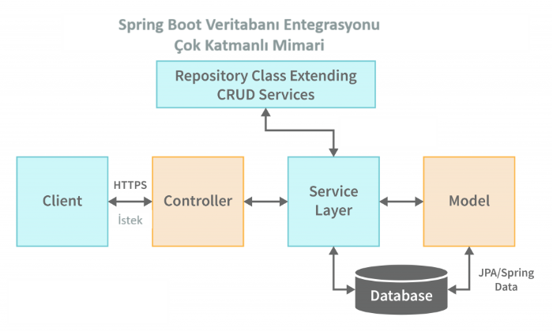

--
**Spring Data JPA ile Veritabanı İşlemleri**

Spring Data JPA, Java Persistence API (JPA) ile veritabanı işlemlerini kolaylaştıran bir modül. JPA, veritabanı işlemlerini nesne yönelimli bir şekilde yapmamızı sağlıyor. Yani, SQL sorguları yazmak yerine, Java sınıfları ve metodları kullanarak veritabanı işlemlerini gerçekleştiriyoruz. 🎯

Öncelikle, bir veritabanı tablosunu temsil eden bir model sınıfı oluşturalım.

```java
package tr.com.huseyinaydin.model;

import javax.persistence.Entity;
import javax.persistence.GeneratedValue;
import javax.persistence.GenerationType;
import javax.persistence.Id;

@Entity
public class Product {

    @Id
    @GeneratedValue(strategy = GenerationType.IDENTITY)

    private Long id;

    private String name;

    private double price;

    // Getter ve Setter metodları

    public Long getId() {
        return id;
    }

    public void setId(Long id) {
        this.id = id;
    }

    public String getName() {
        return name;
    }

    public void setName(String name) {
        this.name = name;
    }

    public double getPrice() {
        return price;
    }

    public void setPrice(double price) {
        this.price = price;
    }
}
```

Bu sınıf, veritabanında bir tabloya karşılık geliyor. @Entity anotasyonu, bu sınıfın bir veritabanı tablosunu temsil ettiğini belirtiyor. @Id ve @GeneratedValue anotasyonları ise birincil anahtar (primary key) ve otomatik artan bir değer olduğunu gösteriyor.

package tr.com.huseyinaydin.repository;

//بسم الله الرحمن الرحيم

/\*\*

 \*

 \* @author Huseyin_Aydin

 \* @since 1994

 \* @category Java, Spring Boot.

 \*

 \*/

import tr.com.huseyinaydin.model.Product;

import org.springframework.data.jpa.repository.JpaRepository;

public interface ProductRepository extends JpaRepository<Product, Long> {

}

Bu repository, Spring Data JPA tarafından sağlanan JpaRepository arayüzünü genişletiyor. Bu sayede, save, findAll, findById, delete gibi temel CRUD işlemlerini otomatik olarak kullanabiliyoruz. 🎉

```java
package tr.com.huseyinaydin.service;

import tr.com.huseyinaydin.model.Product;
import tr.com.huseyinaydin.repository.ProductRepository;
import org.springframework.beans.factory.annotation.Autowired;
import org.springframework.stereotype.Service;
import java.util.List;

@Service
public class ProductService {

    @Autowired
    private ProductRepository productRepository;

    public List<Product> getAllProducts() {
        return productRepository.findAll();
    }

    public Product createProduct(Product product) {
        return productRepository.save(product);
    }
}
```

Bu servis sınıfı, ProductRepository üzerinden veritabanı işlemlerini gerçekleştiriyor. Örneğin, createProduct metodu, bir ürünü veritabanına kaydediyor.

-----
**Hibernate ve Spring Boot Entegrasyonu**

Hibernate, JPA'nın bir implementasyonudur. Spring Boot, Hibernate ile otomatik olarak entegre olur. Yani, Hibernate'i ayrıca yapılandırmanıza gerek yok. Spring Boot, application.properties veya application.yml dosyasındaki ayarlara göre Hibernate'i otomatik olarak yapılandırır. 🛠️

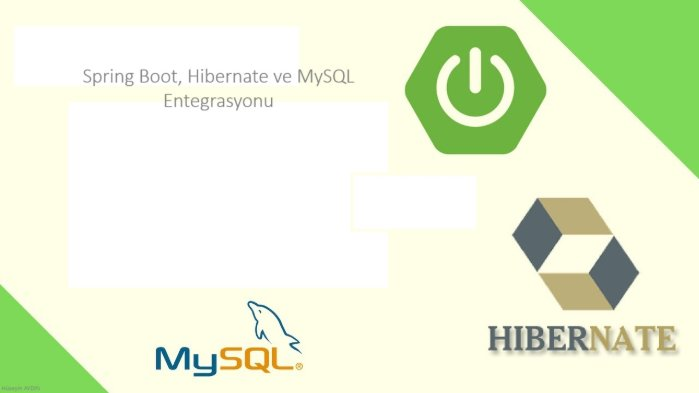

Örneğin, MySQL veritabanı kullanıyorsanız, application.properties dosyasına şu ayarları ekleyebilirsiniz:

```
spring.datasource.url=jdbc:mysql://localhost:3306/urunler
spring.datasource.username=root
spring.datasource.password=123456
spring.jpa.hibernate.ddl-auto=update
spring.jpa.show-sql=true
```

**Bu ayarlar:**

**spring.datasource.url:** Veritabanı bağlantı URL'si.

```
spring.datasource.username ve spring.datasource.password: Veritabanı kullanıcı adı ve şifresi.
```

**spring.jpa.hibernate.ddl-auto:** Veritabanı şemasını otomatik olarak günceller.

**spring.jpa.show-sql:** Konsolda çalışan SQL sorgularını gösterir.

-----
**NoSQL Veritabanları ile Çalışma (MongoDB, Redis, Elasticsearch)**

Spring Boot, sadece SQL veritabanlarıyla değil, NoSQL veritabanlarıyla da çalışabilir. Özellikle MongoDB, Redis ve Elasticsearch gibi popüler NoSQL veritabanları için harika destek sunar. 🚀

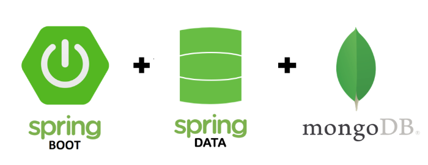

**MongoDB ile Çalışma**

MongoDB, belge tabanlı bir NoSQL veritabanıdır. Spring Boot ile MongoDB entegrasyonu oldukça kolaydır. Öncelikle, pom.xml dosyasına MongoDB bağımlılığını ekleyelim:

```xml
<dependency>
    <groupId>org.springframework.boot</groupId>
    <artifactId>spring-boot-starter-data-mongodb</artifactId>
</dependency>
```

Daha sonra, bir model sınıfı oluşturalım:

```java
package tr.com.huseyinaydin.model;

import org.springframework.data.annotation.Id;
import org.springframework.data.mongodb.core.mapping.Document;

@Document(collection = "products")
public class Product {

    @Id
    private String id;

    private String name;

    private double price;

    // Getter ve Setter metodları

    public String getId() {
        return id;
    }

    public void setId(String id) {
        this.id = id;
    }

    public String getName() {
        return name;
    }

    public void setName(String name) {
        this.name = name;
    }

    public double getPrice() {
        return price;
    }

    public void setPrice(double price) {
        this.price = price;
    }
}
```

Bu sınıf, MongoDB'deki bir koleksiyonu temsil ediyor. @Document anotasyonu, koleksiyon adını belirtiyor.

```java
package tr.com.huseyinaydin.repository;

import tr.com.huseyinaydin.model.Product;
import org.springframework.data.mongodb.repository.MongoRepository;

public interface ProductRepository extends MongoRepository<Product, String> {

}
```

Bu repository, MongoDB için temel CRUD işlemlerini sağlıyor.

**Redis ile Çalışma**

|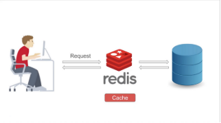|<p>Redis, in-memory bir veri yapısı deposudur. Genellikle caching ve oturum yönetimi için kullanılır. Spring Boot ile Redis entegrasyonu da oldukça kolaydır. Öncelikle, pom.xml dosyasına Redis bağımlılığını ekleyelim(aşağıda):</p><p></p>|
| :- | :- |

```xml
<dependency>
    <groupId>org.springframework.boot</groupId>
    <artifactId>spring-boot-starter-data-redis</artifactId>
</dependency>
```

Daha sonra, Redis yapılandırması yapalım:

```java
package tr.com.huseyinaydin.config;

import org.springframework.context.annotation.Bean;
import org.springframework.context.annotation.Configuration;
import org.springframework.data.redis.connection.RedisConnectionFactory;
import org.springframework.data.redis.core.RedisTemplate;

@Configuration
public class RedisConfig {

    @Bean
    public RedisTemplate<String, Object> redisTemplate(RedisConnectionFactory connectionFactory) {
        RedisTemplate<String, Object> template = new RedisTemplate<>();
        template.setConnectionFactory(connectionFactory);
        return template;
    }
}
```

Bu yapılandırma, Redis bağlantısını sağlıyor.

-----
**JDBC Template ve Veritabanı Bağlantıları**

Spring Boot, JDBC Template ile de veritabanı işlemlerini kolaylaştırır. JDBC Template, SQL sorgularını doğrudan çalıştırmak için kullanılır. Örneğin:

```java
package tr.com.huseyinaydin.repository;

import org.springframework.beans.factory.annotation.Autowired;
import org.springframework.jdbc.core.JdbcTemplate;
import org.springframework.stereotype.Repository;

@Repository
public class ProductRepository {

    @Autowired
    private JdbcTemplate jdbcTemplate;

    public void createProduct(String name, double price) {
        String sql = "INSERT INTO products (name, price) VALUES (?, ?)";
        jdbcTemplate.update(sql, name, price);
    }
}
```

Bu örnekte, JdbcTemplate kullanarak bir ürün ekliyoruz.

**8. Spring Boot Security**

Spring Boot ile güvenlik, özellikle modern web uygulamaları ve API'ler için hayati bir konu. 🔒 Spring Security, uygulamalarımızı yetkisiz erişimlere, saldırılara ve diğer güvenlik tehditlerine karşı korumak için bize güçlü bir araç seti sunuyor. Peki, Spring Boot Security ile neler yapabiliriz? Hadi adım adım inceleyelim. 👇


-----
**Spring Security ile Kimlik Doğrulama ve Yetkilendirme**

Spring Security, kimlik doğrulama (authentication) ve yetkilendirme (authorization) işlemlerini kolaylaştıran bir modül. Kimlik doğrulama, kullanıcının kim olduğunu doğrulamak için kullanılırken, yetkilendirme ise kullanıcının belirli kaynaklara erişim izni olup olmadığını kontrol eder. 🛡️

Öncelikle, Spring Security'yi projemize ekleyelim. Bunun için pom.xml dosyasına şu bağımlılığı ekleyebiliriz:

```xml
<dependency>
    <groupId>org.springframework.boot</groupId>
    <artifactId>spring-boot-starter-security</artifactId>
</dependency>
```

Bu bağımlılık, Spring Security'yi projemize dahil eder. Şimdi, basit bir kimlik doğrulama örneği yapalım. Örneğin, bir kullanıcı adı ve şifre ile giriş yapılabilen bir sistem oluşturalım.

Spring Security'nin varsayılan yapılandırması, otomatik olarak bir kullanıcı adı ve şifre oluşturur. Ancak, bu yapılandırmayı özelleştirebiliriz. İşte örnek bir yapılandırma:

```java
package tr.com.huseyinaydin.config;

import org.springframework.context.annotation.Bean;
import org.springframework.context.annotation.Configuration;
import org.springframework.security.config.annotation.web.builders.HttpSecurity;
import org.springframework.security.config.annotation.web.configuration.EnableWebSecurity;
import org.springframework.security.core.userdetails.User;
import org.springframework.security.core.userdetails.UserDetails;
import org.springframework.security.core.userdetails.UserDetailsService;
import org.springframework.security.provisioning.InMemoryUserDetailsManager;
import org.springframework.security.web.SecurityFilterChain;

@Configuration
@EnableWebSecurity
public class SecurityConfig {

    @Bean
    public SecurityFilterChain securityFilterChain(HttpSecurity http) throws Exception {
        http
            .authorizeHttpRequests((requests) -> requests
            .requestMatchers("/public/\*\*").permitAll() // Herkese açık endpoint'ler
            .anyRequest().authenticated() // Diğer tüm endpoint'ler için kimlik doğrulama
            )
            .formLogin((form) -> form
            .loginPage("/login") // Özel login sayfası
            .permitAll())
        .logout((logout) -> logout.permitAll());

        return http.build();
    }

    @Bean
    public UserDetailsService userDetailsService() {
        UserDetails user = User.withDefaultPasswordEncoder()
            .username("user")
            .password("password")
            .roles("USER")
            .build();

        return new InMemoryUserDetailsManager(user);
    }
}
```

**Bu yapılandırmada:**

/public/\*\* endpoint'leri herkese açık.

Diğer tüm endpoint'ler için kimlik doğrulama gerekiyor.

/login sayfası, özel bir login sayfası olarak kullanılıyor.

UserDetailsService ile bir kullanıcı oluşturuluyor ve bu kullanıcı, InMemoryUserDetailsManager ile yönetiliyor.

-----
**OAuth2 ve JWT ile Güvenli API Geliştirme**

OAuth2 ve JWT (JSON Web Token), modern API'lerde kimlik doğrulama ve yetkilendirme için sıkça kullanılan yöntemlerdir. OAuth2, yetkilendirme protokolü olarak çalışırken, JWT ise kimlik doğrulama bilgilerini taşımak için kullanılır. 🛡️

Öncelikle, JWT kullanmak için pom.xml dosyasına şu bağımlılıkları ekleyelim:

```xml
<dependency>
    <groupId>io.jsonwebtoken</groupId>
    <artifactId>jjwt</artifactId>
    <version>0.9.1</version>
</dependency>

<dependency>
    <groupId>org.springframework.boot</groupId>
    <artifactId>spring-boot-starter-security</artifactId>
</dependency>
```

Daha sonra, JWT oluşturma ve doğrulama işlemleri için bir yardımcı sınıf oluşturalım:

```java
package tr.com.huseyinaydin.util;

import io.jsonwebtoken.Claims;
import io.jsonwebtoken.Jwts;
import io.jsonwebtoken.SignatureAlgorithm;
import org.springframework.security.core.userdetails.UserDetails;
import org.springframework.stereotype.Component;
import java.util.Date;
import java.util.HashMap;
import java.util.Map;
import java.util.function.Function;

@Component
public class JwtUtil {

    private String SECRET_KEY = "secret";

    public String extractUsername(String token) {
        return extractClaim(token, Claims::getSubject);
    }

    public Date extractExpiration(String token) {
        return extractClaim(token, Claims::getExpiration);
    }

    public <T> T extractClaim(String token, Function<Claims, T> claimsResolver) {
        final Claims claims = extractAllClaims(token);
        return claimsResolver.apply(claims);
    }

    private Claims extractAllClaims(String token) {
        return Jwts.parser().setSigningKey(SECRET_KEY).parseClaimsJws(token).getBody();
    }

    private Boolean isTokenExpired(String token) {
        return extractExpiration(token).before(new Date());
    }

    public String generateToken(UserDetails userDetails) {
        Map<String, Object> claims = new HashMap<>();
        return createToken(claims, userDetails.getUsername());
    }

    private String createToken(Map<String, Object> claims, String subject) {
        return Jwts.builder()
                .setClaims(claims)
                .setSubject(subject)
                .setIssuedAt(new Date(System.currentTimeMillis()))
                .setExpiration(new Date(System.currentTimeMillis() + 1000 \* 60 \* 60 \* 10)) // 10 saat geçerli
                .signWith(SignatureAlgorithm.HS256, SECRET_KEY)
                .compact();
    }

    public Boolean validateToken(String token, UserDetails userDetails) {
        final String username = extractUsername(token);
        return (username.equals(userDetails.getUsername()) && !isTokenExpired(token));
    }
}
```

Bu sınıf, JWT oluşturma, doğrulama ve kullanıcı bilgilerini çıkarma işlemlerini yönetiyor.

-----
**Spring Boot'ta Güvenlik Yapılandırması Nasıl Yapılır?**

Spring Boot'ta güvenlik yapılandırması, SecurityFilterChain ve UserDetailsService gibi bileşenlerle yapılır. Örneğin, JWT tabanlı kimlik doğrulama için şu yapılandırmayı kullanabiliriz:

```java
package tr.com.huseyinaydin.config;

import org.springframework.context.annotation.Bean;
import org.springframework.context.annotation.Configuration;
import org.springframework.security.authentication.AuthenticationManager;
import org.springframework.security.config.annotation.authentication.builders.AuthenticationManagerBuilder;
import org.springframework.security.config.annotation.web.builders.HttpSecurity;
import org.springframework.security.config.annotation.web.configuration.EnableWebSecurity;
import org.springframework.security.config.http.SessionCreationPolicy;
import org.springframework.security.core.userdetails.UserDetailsService;
import org.springframework.security.crypto.password.NoOpPasswordEncoder;
import org.springframework.security.crypto.password.PasswordEncoder;
import org.springframework.security.web.SecurityFilterChain;
import org.springframework.security.web.authentication.UsernamePasswordAuthenticationFilter;

@Configuration
@EnableWebSecurity
public class SecurityConfig {

    private final JwtRequestFilter jwtRequestFilter;

    public SecurityConfig(JwtRequestFilter jwtRequestFilter) {
        this.jwtRequestFilter = jwtRequestFilter;
    }

    @Bean

    public SecurityFilterChain securityFilterChain(HttpSecurity http) throws Exception {
        http.csrf().disable()
            .authorizeHttpRequests()
            .requestMatchers("/authenticate").permitAll()
            .anyRequest().authenticated()
            .and()
            .sessionManagement().sessionCreationPolicy(SessionCreationPolicy.STATELESS);
                    http.addFilterBefore(jwtRequestFilter, UsernamePasswordAuthenticationFilter.class);
                    return http.build();
                }

    @Bean
    public PasswordEncoder passwordEncoder() {
        return NoOpPasswordEncoder.getInstance();
    }
}
```

**Bu yapılandırmada:**

/authenticate endpoint'i herkese açık.

Diğer tüm endpoint'ler için kimlik doğrulama gerekiyor.

JWT tabanlı kimlik doğrulama, JwtRequestFilter ile sağlanıyor.

-----
**CSRF, XSS ve Diğer Güvenlik Tehditlerine Karşı Koruma**

Spring Security, CSRF (Cross-Site Request Forgery) ve XSS (Cross-Site Scripting) gibi yaygın güvenlik tehditlerine karşı koruma sağlar. Örneğin, CSRF korumasını etkinleştirmek için şu yapılandırmayı kullanabiliriz:

http.csrf().csrfTokenRepository(CookieCsrfTokenRepository.withHttpOnlyFalse());

XSS koruması için ise, gelen verileri temizlemek ve doğrulamak önemlidir. Spring Security, bu tür saldırılara karşı otomatik koruma sağlar.

**9. Spring Batch**

Spring Batch, büyük veri kümelerini işlemek ve tekrarlanabilir işlemleri otomatikleştirmek için kullanılan güçlü bir framework. 🛠️ Özellikle arka planda çalışan, uzun süren ve büyük miktarda veriyi işleyen görevler için birebir. Peki, Spring Batch tam olarak nedir ve ne zaman kullanılır? Hadi adım adım inceleyelim. 👇


-----
**Spring Batch Nedir ve Ne Zaman Kullanılır?**

Spring Batch, özellikle şu senaryolarda kullanılır:

**Büyük Veri İşleme:** Örneğin, bir CSV dosyasındaki milyonlarca kaydı okuyup veritabanına kaydetmek.

**Zamanlanmış Görevler:** Belirli aralıklarla çalışan ve veri işleyen görevler.

**Eşzamanlı İşlemler:** Birden fazla işlemi paralel olarak yürütmek.

**Hata Yönetimi:** İşlem sırasında oluşan hataları yönetmek ve işlemi kaldığı yerden devam ettirmek.

Spring Batch, bu tür işlemleri kolaylaştırmak için bir dizi bileşen sunar: Job, Step, Reader, Processor, Writer gibi. 🧩

-----
**Batch İşlemlerinin Adımları (Job, Step, Reader, Processor, Writer)**

Spring Batch'de bir işlem (job), birden fazla adımdan (step) oluşur. Her adım, bir Reader, Processor ve Writer bileşenini içerir. İşte bu bileşenlerin görevleri:

**Reader:** Veriyi okur. Örneğin, bir CSV dosyasından veya veritabanından kayıtları okur.

**Processor:** Okunan veriyi işler. Örneğin, veriyi filtreler veya dönüştürür.

**Writer:** İşlenen veriyi kaydeder. Örneğin, veritabanına veya başka bir dosyaya yazar.

Örnek bir batch işlemi yapalım. Diyelim ki bir CSV dosyasındaki ürün bilgilerini okuyup veritabanına kaydedeceğiz. 🛒

-----
**Spring Boot ile Batch İşlemleri Örnekleri**

Öncelikle, Spring Batch'i projemize ekleyelim. Bunun için pom.xml dosyasına şu bağımlılıkları ekleyebiliriz:

```xml
<dependency>
    <groupId>org.springframework.boot</groupId>
    <artifactId>spring-boot-starter-batch</artifactId>
</dependency>

<dependency>
    <groupId>org.springframework.boot</groupId>
    <artifactId>spring-boot-starter-data-jpa</artifactId>
</dependency>

<dependency>
    <groupId>com.h2database</groupId>
    <artifactId>h2</artifactId>
    <scope>runtime</scope>
</dependency>
```

Bu bağımlılıklar, Spring Batch ve veritabanı işlemleri için gerekli kütüphaneleri ekler.

Şimdi, bir Product model sınıfı oluşturalım:

```java
package tr.com.huseyinaydin.model;

import javax.persistence.Entity;
import javax.persistence.GeneratedValue;
import javax.persistence.GenerationType;
import javax.persistence.Id;

@Entity
public class Product {

    @Id
    @GeneratedValue(strategy = GenerationType.IDENTITY)

    private Long id;

    private String name;

    private double price;

    // Getter ve Setter metodları

    public Long getId() {
        return id;
    }

    public void setId(Long id) {
        this.id = id;
    }

    public String getName() {
        return name;
    }

    public void setName(String name) {
        this.name = name;
    }

    public double getPrice() {
        return price;
    }

    public void setPrice(double price) {
        this.price = price;
    }
}
```

Daha sonra, bir ProductRepository oluşturalım:

```java
package tr.com.huseyinaydin.repository;

import tr.com.huseyinaydin.model.Product;
import org.springframework.data.jpa.repository.JpaRepository;

public interface ProductRepository extends JpaRepository<Product, Long> {

}
```

Şimdi, batch işlemi için gerekli bileşenleri oluşturalım. İlk olarak, bir ProductReader sınıfı yazalım:

```java
package tr.com.huseyinaydin.batch;

import org.springframework.batch.item.ItemReader;
import org.springframework.batch.item.NonTransientResourceException;
import org.springframework.batch.item.ParseException;
import org.springframework.batch.item.UnexpectedInputException;
import org.springframework.stereotype.Component;
import java.util.Arrays;
import java.util.List;

@Component
public class ProductReader implements ItemReader<String> {

    private int nextProductIndex;

    private List<String> productData = Arrays.asList("Ürün 1, 100", "Ürün 2, 200", "Ürün 3, 300");

    @Override
    public String read() throws Exception, UnexpectedInputException, ParseException, NonTransientResourceException {
        if (nextProductIndex < productData.size()) {
            return productData.get(nextProductIndex++);
        } else {
            return null;
        }
    }
}
```

Bu sınıf, CSV dosyasındaki verileri okur gibi simüle ediyor. Şimdi, bir ProductProcessor sınıfı yazalım:

```java
package tr.com.huseyinaydin.batch;

import org.springframework.batch.item.ItemProcessor;
import org.springframework.stereotype.Component;
import tr.com.huseyinaydin.model.Product;

@Component
public class ProductProcessor implements ItemProcessor<String, Product> {

    @Override
    public Product process(String item) throws Exception {
        String[] data = item.split(", ");
        Product product = new Product();
        product.setName(data[0]);
        product.setPrice(Double.parseDouble(data[1]));
        return product;
    }
}
```

Bu sınıf, okunan veriyi işleyip Product nesnesine dönüştürüyor. Son olarak, bir ProductWriter sınıfı yazalım:

```java
package tr.com.huseyinaydin.batch;

import org.springframework.batch.item.ItemWriter;
import org.springframework.beans.factory.annotation.Autowired;
import org.springframework.stereotype.Component;
import tr.com.huseyinaydin.model.Product;
import tr.com.huseyinaydin.repository.ProductRepository;
import java.util.List;

@Component
public class ProductWriter implements ItemWriter<Product> {
    
    @Autowired
    private ProductRepository productRepository;

    @Override
    public void write(List<? extends Product> items) throws Exception {
        productRepository.saveAll(items);
    }
}
```

Bu sınıf, işlenen veriyi veritabanına kaydediyor.

-----
**Batch İşlemlerinde Hata Yönetimi ve Retry Mekanizmaları**

Batch işlemlerinde hatalar kaçınılmazdır. Özellikle büyük veri kümeleriyle çalışırken, bazı kayıtlar hatalı olabilir. Spring Batch, bu tür durumlar için retry (yeniden deneme) ve skip (atlayarak devam etme) mekanizmaları sunar. 🛠️

Örneğin, bir kayıt işlenirken hata oluştuğunda, bu kaydı atlayıp işleme devam edebiliriz. İşte örnek bir yapılandırma:

```java
package tr.com.huseyinaydin.config;

import org.springframework.batch.core.Job;
import org.springframework.batch.core.Step;
import org.springframework.batch.core.configuration.annotation.EnableBatchProcessing;
import org.springframework.batch.core.configuration.annotation.JobBuilderFactory;
import org.springframework.batch.core.configuration.annotation.StepBuilderFactory;
import org.springframework.batch.core.launch.support.RunIdIncrementer;
import org.springframework.batch.item.support.ListItemReader;
import org.springframework.beans.factory.annotation.Autowired;
import org.springframework.context.annotation.Bean;
import org.springframework.context.annotation.Configuration;
import tr.com.huseyinaydin.batch.ProductProcessor;
import tr.com.huseyinaydin.batch.ProductReader;
import tr.com.huseyinaydin.batch.ProductWriter;

@Configuration
@EnableBatchProcessing
public class BatchConfig {

    @Autowired
    private JobBuilderFactory jobBuilderFactory;

    @Autowired
    private StepBuilderFactory stepBuilderFactory;

    @Autowired
    private ProductReader productReader;

    @Autowired
    private ProductProcessor productProcessor;

    @Autowired
    private ProductWriter productWriter;

    @Bean
    public Job importProductJob() {
        return jobBuilderFactory.get("importProductJob")
                .incrementer(new RunIdIncrementer())
                .flow(step1())
                .end()
                .build();
    }

    @Bean
    public Step step1() {
        return stepBuilderFactory.get("step1")
        .<String, Product>chunk(10)
        .reader(productReader)
        .processor(productProcessor)
        .writer(productWriter)
        .faultTolerant()
        .skipLimit(10) // Maksimum 10 hata atlanabilir
        .skip(Exception.class) // Tüm hataları atla
        .build();
    }
}
```

Bu yapılandırmada:

**skipLimit(10):** Maksimum 10 hata atlanabilir.

**skip(Exception.class):** Tüm hataları atlayarak işleme devam eder.

-----
**Batch İşlemlerinde Retry Mekanizması**

Retry mekanizması, bir işlem başarısız olduğunda belirli bir sayıda yeniden deneme yapar. Örneğin:
```java
stepBuilderFactory.get("step1")
.<String, Product>chunk(10)
.reader(productReader)
.processor(productProcessor)
.writer(productWriter)
.faultTolerant()
.retryLimit(3) // Maksimum 3 yeniden deneme
.retry(Exception.class) // Tüm hatalarda yeniden dene
.build();
```

Bu yapılandırmada, bir işlem başarısız olduğunda 3 kez yeniden deneme yapılır.

**10. Spring Boot ve Redis**

Redis, modern uygulama geliştirme dünyasında adeta bir süper kahraman gibi. 🦸‍♂️ Özellikle hızlı veri erişimi, caching ve gerçek zamanlı işlemler için birebir. Peki, Redis tam olarak nedir ve Spring Boot ile nasıl entegre edilir? Hadi adım adım inceleyelim. 👇

-----
**Redis Nedir ve Spring Boot ile Nasıl Entegre Edilir?**

Redis, açık kaynaklı, in-memory bir veri yapısı deposudur. 🛠️ Yani, verileri disk yerine RAM'de tutar ve bu sayede çok hızlı erişim sağlar. Redis, genellikle caching, oturum yönetimi, mesaj kuyrukları ve gerçek zamanlı analizler için kullanılır.

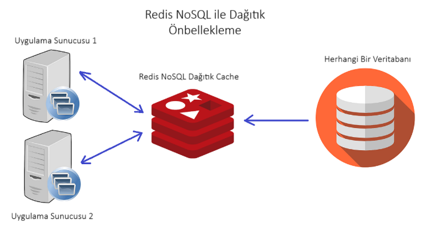

Spring Boot ile Redis entegrasyonu oldukça kolaydır. Öncelikle, Redis'i projemize ekleyelim. Bunun için pom.xml dosyasına şu bağımlılığı ekleyebiliriz:

```xml
<dependency>
    <groupId>org.springframework.boot</groupId>
    <artifactId>spring-boot-starter-data-redis</artifactId>
</dependency>
```

Bu bağımlılık, Spring Boot'un Redis ile çalışmasını sağlar. Şimdi, Redis yapılandırması yapalım. Bunun için application.properties dosyasına şu ayarları ekleyebiliriz:

```
spring.redis.host=localhost
spring.redis.port=6379
```

Bu ayarlar, Redis sunucusunun adresini ve portunu belirtir. Eğer Redis sunucusu farklı bir yerde çalışıyorsa, bu bilgileri güncelleyebilirsiniz.

-----
**Redis ile Caching Mekanizmaları**

Redis, özellikle caching (önbellekleme) için çok popülerdir. Caching, uygulamanın performansını artırmak için sık kullanılan verileri bellekte tutar. Böylece, her seferinde veritabanına gitmek yerine, verilere hızlıca erişebiliriz. 🚀

Spring Boot'ta Redis ile caching yapmak için öncelikle @EnableCaching anotasyonunu kullanmamız gerekiyor. İşte örnek bir yapılandırma:

```java
package tr.com.huseyinaydin.config;

import org.springframework.cache.annotation.EnableCaching;
import org.springframework.context.annotation.Bean;
import org.springframework.context.annotation.Configuration;
import org.springframework.data.redis.connection.RedisConnectionFactory;
import org.springframework.data.redis.core.RedisTemplate;

@Configuration
@EnableCaching
public class RedisConfig {

    @Bean
    public RedisTemplate<String, Object> redisTemplate(RedisConnectionFactory connectionFactory) {
        RedisTemplate<String, Object> template = new RedisTemplate<>()
        template.setConnectionFactory(connectionFactory);

        return template;
    }
}
```

Bu yapılandırma, Redis bağlantısını sağlar ve caching'i etkinleştirir. Şimdi, bir servis sınıfı yazalım ve caching mekanizmasını kullanalım:

```java
package tr.com.huseyinaydin.service;

import org.springframework.cache.annotation.Cacheable;
import org.springframework.stereotype.Service;
import tr.com.huseyinaydin.model.Product;
import tr.com.huseyinaydin.repository.ProductRepository;
import java.util.List;

@Service
public class ProductService {

    private final ProductRepository productRepository;

    public ProductService(ProductRepository productRepository) {
        this.productRepository = productRepository;
    }

    @Cacheable(value = "products")
    public List<Product> getAllProducts() {
        return productRepository.findAll();
    }
}
```

Bu servis sınıfında, **@Cacheable** anotasyonu ile getAllProducts metodunun sonucunu önbelleğe alıyoruz. Yani, bu metod ilk çağrıldığında veritabanından verileri çeker ve Redis'te önbelleğe alır. Sonraki çağrımlarda ise veriler Redis'ten okunur. 🎉

-----
**Redis'in Spring Boot'ta Kullanım Alanları**

Redis, Spring Boot'ta birçok farklı amaçla kullanılabilir. İşte en popüler kullanım alanları:

**1. Session Management (Oturum Yönetimi)**

Redis, oturum bilgilerini saklamak için harika bir seçenektir. Özellikle mikroservis mimarilerinde, oturum bilgilerini merkezi bir yerde tutmak için kullanılır. 🛡️

Örneğin, Spring Session ile Redis kullanarak oturum yönetimi yapabiliriz. Bunun için pom.xml dosyasına şu bağımlılığı ekleyebiliriz:

```xml
<dependency>
    <groupId>org.springframework.session</groupId>
    <artifactId>spring-session-data-redis</artifactId>
</dependency>
```

Daha sonra, application.properties dosyasına şu ayarı ekleyebiliriz:

```
spring.session.store-type=redis
```

Bu ayar, oturum bilgilerinin Redis'te saklanmasını sağlar.

**2. Pub/Sub (Yayın/Abonelik)**

Redis, Pub/Sub (Publish/Subscribe) modelini destekler. Bu model, mesajlaşma sistemlerinde kullanılır. Örneğin, bir kullanıcı bir mesaj yayınlar (publish) ve diğer kullanıcılar bu mesajı dinler (subscribe). 📢

Spring Boot'ta Redis Pub/Sub kullanmak için öncelikle bir mesaj dinleyici (listener) sınıfı oluşturalım:

```java
package tr.com.huseyinaydin.listener;

import org.springframework.data.redis.connection.Message;
import org.springframework.data.redis.connection.MessageListener;
import org.springframework.stereotype.Service;

@Service
public class RedisMessageListener implements MessageListener {

    @Override
    public void onMessage(Message message, byte[] pattern) {
        System.out.println("Mesaj alındı: " + new String(message.getBody()));
    }
}
```

Bu sınıf, Redis'ten gelen mesajları dinler ve konsola yazar. Şimdi, bir mesaj yayınlayan (publisher) sınıfı oluşturalım:

```java
package tr.com.huseyinaydin.service;

import org.springframework.data.redis.core.RedisTemplate;
import org.springframework.stereotype.Service;

@Service
public class RedisMessagePublisher {
    private final RedisTemplate<String, Object> redisTemplate;

    public RedisMessagePublisher(RedisTemplate<String, Object> redisTemplate) {
        this.redisTemplate = redisTemplate;
    }

    public void publishMessage(String channel, String message) {
        redisTemplate.convertAndSend(channel, message);
    }
}
```

Bu sınıf, belirli bir kanala mesaj yayınlar. Örneğin:

```java
redisMessagePublisher.publishMessage("myChannel", "Maraba Redis Baba Al bizede bir araba hobbala! :D");
```

Bu kod, myChannel adlı kanala "Merhaba Redis!" mesajını yayınlar.

-----
**Redis'in Diğer Kullanım Alanları**

Gerçek Zamanlı Analizler: Redis, gerçek zamanlı veri analizleri için kullanılabilir. Örneğin, bir web sitesindeki ziyaretçi sayısını anlık olarak takip etmek.

**Mesaj Kuyrukları:** Redis, basit mesaj kuyrukları oluşturmak için kullanılabilir. Özellikle arka planda çalışan görevler için idealdir.

**Rate Limiting:** Redis, API'lerde rate limiting (hız sınırlama) için kullanılabilir. Örneğin, bir kullanıcının belirli bir süre içinde yapabileceği istek sayısını sınırlamak.

**11. Spring Boot ve MongoDB**

MongoDB, NoSQL veritabanları arasında en popüler olanlardan biridir. 🏆 Özellikle esnek veri yapısı ve yüksek performansıyla öne çıkar. Peki, MongoDB tam olarak nedir ve Spring Boot ile nasıl kullanılır? Hadi adım adım inceleyelim. 👇

-----
**MongoDB Nedir ve Spring Boot ile Nasıl Kullanılır?**

MongoDB, belge tabanlı bir NoSQL veritabanıdır. 🗂️ Yani, verileri JSON benzeri belgeler halinde saklar. Bu, geleneksel SQL veritabanlarındaki tablo yapısından farklıdır. MongoDB'nin en büyük avantajı, esnek veri yapısı ve kolay ölçeklenebilir olmasıdır.

Spring Boot ile MongoDB entegrasyonu oldukça kolaydır. Öncelikle, MongoDB'yi projemize ekleyelim. Bunun için pom.xml dosyasına şu bağımlılığı ekleyebiliriz:

```xml
<dependency>
    <groupId>org.springframework.boot</groupId>
    <artifactId>spring-boot-starter-data-mongodb</artifactId>
</dependency>
```

Bu bağımlılık, Spring Boot'un MongoDB ile çalışmasını sağlar. Şimdi, MongoDB yapılandırması yapalım. Bunun için application.properties dosyasına şu ayarları ekleyebiliriz:

```
spring.data.mongodb.uri=mongodb://localhost:27017/urunler
```

Bu ayar, MongoDB sunucusunun adresini ve veritabanı adını belirtir. Eğer MongoDB sunucusu farklı bir yerde çalışıyorsa, bu bilgileri güncelleyebilirsiniz.

-----
**Spring Data MongoDB ile NoSQL Veritabanı İşlemleri**

Spring Data MongoDB, MongoDB ile çalışmayı kolaylaştıran bir modüldür. 🛠️ Bu modül sayesinde, MongoDB'deki belgeleri Java nesneleri olarak yönetebiliriz. Öncelikle, bir model sınıfı oluşturalım. Örneğin, Product adında bir sınıf yazalım:

```java
package tr.com.huseyinaydin.model;

import org.springframework.data.annotation.Id;
import org.springframework.data.mongodb.core.mapping.Document;

@Document(collection = "products")
public class Product {

    @Id
    private String id;

    private String name;

    private double price;

    // Getter ve Setter metodları
    public String getId() {
        return id;
    }

    public void setId(String id) {
        this.id = id;
    }

    public String getName() {
        return name;
    }

    public void setName(String name) {
        this.name = name;
    }

    public double getPrice() {
        return price;
    }

    public void setPrice(double price) {
        this.price = price;
    }
}
```

Bu sınıf, MongoDB'deki bir koleksiyonu temsil ediyor. @Document anotasyonu, koleksiyon adını belirtiyor. @Id anotasyonu ise birincil anahtar (primary key) olduğunu gösteriyor.

**Şimdi, bir repository oluşturalım:**

```java
package tr.com.huseyinaydin.repository;

import tr.com.huseyinaydin.model.Product;
import org.springframework.data.mongodb.repository.MongoRepository;
public interface ProductRepository extends MongoRepository<Product, String> {

}
```

Bu repository, MongoDB için temel CRUD işlemlerini sağlıyor. Örneğin, save, findAll, findById, delete gibi metodları otomatik olarak kullanabiliyoruz. 🎉

-----
**MongoDB'de CRUD İşlemleri ve Sorgulama**

MongoDB'de CRUD (Create, Read, Update, Delete) işlemleri yapmak oldukça kolaydır. Şimdi, bu işlemleri Spring Boot ile nasıl yapacağımızı inceleyelim.

**1. Create (Oluşturma)**

Yeni bir ürün oluşturmak için ProductRepository üzerinden save metodunu kullanabiliriz. İşte örnek bir servis sınıfı:

```java
package tr.com.huseyinaydin.service;

import org.springframework.beans.factory.annotation.Autowired;
import org.springframework.stereotype.Service;
import tr.com.huseyinaydin.model.Product;
import tr.com.huseyinaydin.repository.ProductRepository;

@Service
public class ProductService {

    @Autowired
    private ProductRepository productRepository;

    public Product createProduct(Product product) {
        return productRepository.save(product);
    }

    public List<Product> getAllProducts() {
        return productRepository.findAll();
    }
    
    public Product getProductById(String id) {
        return productRepository.findById(id).orElse(null)
    }
}
```

Bu metodlar, tüm ürünleri veya belirli bir ürünü MongoDB'den okur.

**3. Update (Güncelleme)**

MongoDB'de bir belgeyi güncellemek için save metodunu kullanabiliriz. İşte örnek bir metod:

```java
public Product updateProduct(String id, Product productDetails) {
    Product product = productRepository.findById(id).orElse(null);
    if (product != null) {
        product.setName(productDetails.getName());
        product.setPrice(productDetails.getPrice());
        
        return productRepository.save(product);
    }
    return null;
}
```

Bu metod, belirli bir ürünü günceller ve MongoDB'ye kaydeder.

**4. Delete (Silme)**

MongoDB'den bir belgeyi silmek için deleteById metodunu kullanabiliriz. İşte örnek bir metod:

```java
public void deleteProduct(String id) {
    productRepository.deleteById(id);
}
```

Bu metod, belirli bir ürünü MongoDB'den siler.

-----
**MongoDB'de Sorgulama**

MongoDB'de sorgulama yapmak için Spring Data MongoDB'nin sunduğu metodları kullanabiliriz. Örneğin, belirli bir fiyat aralığındaki ürünleri bulmak için şu metodu yazabiliriz:

```java
public List<Product> getProductsByPriceRange(double minPrice, double maxPrice) {
    return productRepository.findByPriceBetween(minPrice, maxPrice);
}
```

Bu metod, ProductRepository içinde tanımlanmış bir sorgu metodudur. İşte repository sınıfı:

```java
package tr.com.huseyinaydin.repository;

import tr.com.huseyinaydin.model.Product;
import org.springframework.data.mongodb.repository.MongoRepository;
import java.util.List;

public interface ProductRepository extends MongoRepository<Product, String> {
    List<Product> findByPriceBetween(double minPrice, double maxPrice);
}
```

Bu metod, belirli bir fiyat aralığındaki ürünleri MongoDB'den okur.

-----
**MongoDB'nin Avantajları**

**Esnek Veri Yapısı:** MongoDB, JSON benzeri belgelerle çalışır. Bu, veri yapısını esnek hale getirir.

**Yüksek Performans:** MongoDB, in-memory işlemler sayesinde yüksek performans sunar.

**Kolay Ölçeklenebilirlik:** MongoDB, yatay ölçeklenebilirlik (horizontal scaling) için idealdir.

**12. Spring Boot ve Elasticsearch**

Elasticsearch, modern uygulama geliştirme dünyasında adeta bir arama motoru süper kahramanı gibi. 🦸‍♂️ Özellikle büyük veri kümelerinde hızlı arama, analiz ve log yönetimi için birebir. Peki, Elasticsearch tam olarak nedir ve Spring Boot ile nasıl entegre edilir? Hadi adım adım inceleyelim. 👇

-----
**Elasticsearch Nedir ve Spring Boot ile Nasıl Entegre Edilir?**

Elasticsearch, açık kaynaklı, dağıtık bir arama ve analiz motorudur. 🛠️ Özellikle büyük veri kümelerinde hızlı ve esnek arama yapmak için kullanılır. Elasticsearch, JSON belgelerini indeksler ve bu belgeler üzerinde hızlı arama yapabilir.

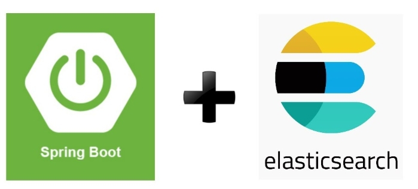

Spring Boot ile Elasticsearch entegrasyonu oldukça kolaydır. Öncelikle, Elasticsearch'ü projemize ekleyelim. Bunun için pom.xml dosyasına şu bağımlılığı ekleyebiliriz:

```xml
<dependency>
    <groupId>org.springframework.boot</groupId>
    <artifactId>spring-boot-starter-data-elasticsearch</artifactId>
</dependency>
```

Bu bağımlılık, Spring Boot'un Elasticsearch ile çalışmasını sağlar. Şimdi, Elasticsearch yapılandırması yapalım. Bunun için application.properties dosyasına şu ayarları ekleyebiliriz:

spring.elasticsearch.rest.uris=http://localhost:9200

Bu ayar, Elasticsearch sunucusunun adresini belirtir. Eğer Elasticsearch sunucusu farklı bir yerde çalışıyorsa, bu bilgileri güncelleyebilirsiniz.

-----
**Index’leme Nedir ve Neden İhtiyaç Duyulur?**

Elasticsearch'te index’leme, verilerin hızlı bir şekilde aranabilir hale getirilmesi işlemidir. 🗂️ Yani, verileri belirli bir yapıda saklayarak, bu verilere hızlıca erişim sağlar. Index’leme, özellikle büyük veri kümelerinde arama performansını artırır.

Örneğin, bir e-ticaret sitesinde milyonlarca ürün bulunabilir. Bu ürünlerin hızlıca aranabilmesi için, ürün bilgilerini Elasticsearch'te indeksleriz. Böylece, kullanıcılar arama yaptığında, sonuçlar anında görüntülenir. 🚀

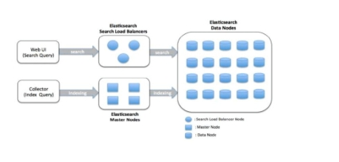

-----
**Spring Data Elasticsearch ile Arama ve Analiz İşlemleri**

Spring Data Elasticsearch, Elasticsearch ile çalışmayı kolaylaştıran bir modüldür. 🛠️ Bu modül sayesinde, Elasticsearch'teki belgeleri Java nesneleri olarak yönetebiliriz. Öncelikle, bir model sınıfı oluşturalım. Örneğin, Product adında bir sınıf yazalım:

```java
package tr.com.huseyinaydin.model;

import org.springframework.data.annotation.Id;
import org.springframework.data.elasticsearch.annotations.Document;
import org.springframework.data.elasticsearch.annotations.Field;
import org.springframework.data.elasticsearch.annotations.FieldType;

@Document(indexName = "products")
public class Product {

    @Id
    private String id;

    @Field(type = FieldType.Text, name = "name")
    private String name;

    @Field(type = FieldType.Double, name = "price")
    private double price;

    // Getter ve Setter metodları

    public String getId() {
        return id;
    }

    public void setId(String id) {
        this.id = id;
    }

    public String getName() {
        return name;
    }

    public void setName(String name) {
        this.name = name;
    }

    public double getPrice() {
        return price;
    }

    public void setPrice(double price) {
        this.price = price;
    }
}
```

Bu sınıf, Elasticsearch'teki bir indeksi temsil ediyor. @Document anotasyonu, indeks adını belirtiyor. @Field anotasyonu ise alanların türünü belirtiyor.

**Şimdi, bir repository oluşturalım:**

```java
package tr.com.huseyinaydin.repository;

import tr.com.huseyinaydin.model.Product;
import org.springframework.data.elasticsearch.repository.ElasticsearchRepository;

public interface ProductRepository extends ElasticsearchRepository<Product, String> {

}
```

Bu repository, Elasticsearch için temel CRUD işlemlerini sağlıyor. Örneğin, save, findAll, findById, delete gibi metodları otomatik olarak kullanabiliyoruz. 🎉

**Elasticsearch'te İndeksleme ve Sorgulama**

Elasticsearch'te indeksleme ve sorgulama işlemleri oldukça kolaydır. Şimdi, bu işlemleri Spring Boot ile nasıl yapacağımızı inceleyelim.

**1. İndeksleme**

Yeni bir ürün oluşturmak ve Elasticsearch'te indekslemek için ProductRepository üzerinden save metodunu kullanabiliriz. İşte örnek bir servis sınıfı:

```java
package tr.com.huseyinaydin.service;

import org.springframework.beans.factory.annotation.Autowired;
import org.springframework.stereotype.Service;
import tr.com.huseyinaydin.model.Product;
import tr.com.huseyinaydin.repository.ProductRepository;

@Service
public class ProductService {

    @Autowired
    private ProductRepository productRepository;

    public Product createProduct(Product product) {
        return productRepository.save(product);
    }
}
```

Bu servis sınıfı, createProduct metodu ile yeni bir ürün oluşturur ve Elasticsearch'te indeksler.

**2. Sorgulama**

Elasticsearch'ten veri okumak için findAll ve findById gibi metodları kullanabiliriz. İşte örnek bir metod:

```java
public List<Product> getAllProducts() {
    return productRepository.findAll();
}

public Product getProductById(String id) {
    return productRepository.findById(id).orElse(null);
}
```

Bu metodlar, tüm ürünleri veya belirli bir ürünü Elasticsearch'ten okur.

**3. Özel Sorgular**

Elasticsearch'te özel sorgular yazmak için @Query anotasyonunu kullanabiliriz. Örneğin, belirli bir fiyat aralığındaki 

```java
public List<Product> getProductsByPriceRange(double minPrice, double maxPrice) {
    return productRepository.findByPriceBetween(minPrice, maxPrice);
}
```

Bu metod, ProductRepository içinde tanımlanmış bir sorgu metodudur. İşte repository sınıfı:

```java
package tr.com.huseyinaydin.repository;

import tr.com.huseyinaydin.model.Product;
import org.springframework.data.elasticsearch.repository.ElasticsearchRepository;
import java.util.List;

public interface ProductRepository extends ElasticsearchRepository<Product, String> 
    List<Product> findByPriceBetween(double minPrice, double maxPrice);
}
```

Bu metod, belirli bir fiyat aralığındaki ürünleri Elasticsearch'ten okur.

-----
**Autocomplete Projesi**

Elasticsearch, özellikle autocomplete (otomatik tamamlama) özellikleri için çok popülerdir. 🚀 Örneğin, bir arama kutusuna yazılan kelimelerin otomatik olarak tamamlanmasını sağlayabiliriz.

Öncelikle, Elasticsearch'te bir n-gram analizörü oluşturalım. Bu analizör, kelimeleri küçük parçalara böler ve otomatik tamamlama için kullanılır. İşte örnek bir yapılandırma:

```json
PUT /products
{
  "settings": {
    "analysis": {
      "analyzer": {
        "autocomplete_analyzer": {
          "tokenizer": "autocomplete_tokenizer",
          "filter": ["lowercase"]
        }
      },

      "tokenizer": {
        "autocomplete_tokenizer": {
          "type": "edge_ngram",
          "min_gram": 2,
          "max_gram": 10,
          "token_chars": ["letter", "digit"]
        }
      }
    }
  },

  "mappings": {
    "properties": {
      "name": {
        "type": "text",
        "analyzer": "autocomplete_analyzer"
      }
    }
  }
}
```

Bu yapılandırma, name alanı için otomatik tamamlama özelliği sağlar. Şimdi, Spring Boot'ta bu özelliği kullanalım. İşte örnek bir repository sınıfı:

```java
package tr.com.huseyinaydin.repository;

import tr.com.huseyinaydin.model.Product;
import org.springframework.data.elasticsearch.repository.ElasticsearchRepository;
import java.util.List;

public interface ProductRepository extends ElasticsearchRepository<Product, String> {
    List<Product> findByNameStartingWith(String name);
}
```

Bu metod, belirli bir kelimeyle başlayan ürünleri Elasticsearch'ten okur.

-----
**Elasticsearch'in Avantajları**

**Hızlı Arama:** Elasticsearch, büyük veri kümelerinde hızlı arama yapabilir.

**Esnek Veri Yapısı:** JSON belgeleriyle çalışır, bu da veri yapısını esnek hale getirir.

**Gerçek Zamanlı Analiz:** Verileri gerçek zamanlı olarak analiz edebilir.

**13. Spring Boot ve Loglama (LogStash, Kibana)**

Loglama, modern yazılım geliştirme dünyasında adeta bir gözlemci gibidir. 👀 Uygulamanın her adımını kaydeder, hataları tespit eder ve performans analizleri yapmamızı sağlar. Peki, loglama tam olarak nedir ve neden bu kadar önemlidir? Hadi adım adım inceleyelim. 👇

-----
**Loglama Nedir ve Neden Önemlidir?**

Loglama, bir uygulamanın çalışma sırasında gerçekleştirdiği işlemleri kaydetme işlemidir. 🗂️ Bu kayıtlar, uygulamanın sağlıklı çalışıp çalışmadığını, hataların nerede oluştuğunu ve performans sorunlarının kaynağını tespit etmek için kullanılır.

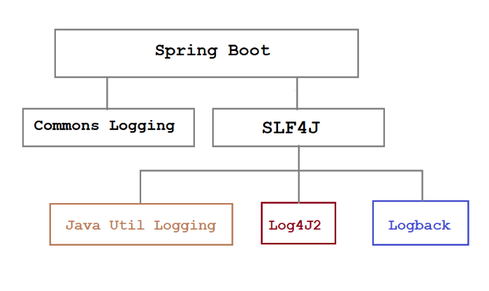

Loglama, özellikle şu durumlarda hayati öneme sahiptir:

**Hata Ayıklama:** Uygulamada oluşan hataların nedenini tespit etmek için loglar kullanılır.

**Performans Analizi:** Uygulamanın performansını izlemek ve yavaşlayan noktaları tespit etmek için loglar analiz edilir.

**Güvenlik:** Yetkisiz erişim girişimleri veya şüpheli aktiviteler loglar sayesinde tespit edilebilir.

**Denetim:** Uygulamanın geçmişteki durumunu incelemek için loglar kullanılır.

Özetle, loglama olmadan bir uygulamanın sağlıklı bir şekilde çalıştığını söylemek neredeyse imkansızdır. 🛡️

**Spring Boot'ta Loglama Yapılandırması ve Log Seviyeleri**

Spring Boot, loglama işlemleri için Logback ve Log4j2 gibi popüler loglama kütüphanelerini destekler. Varsayılan olarak, Spring Boot Logback kullanır. 🛠️

Spring Boot'ta loglama yapılandırması oldukça kolaydır. Öncelikle, application.properties veya application.yml dosyasına loglama ayarlarını ekleyebiliriz. İşte örnek bir yapılandırma:

```
\# Log seviyesini ayarla
logging.level.root=INFO
logging.level.tr.com.huseyinaydin=DEBUG
\# Log dosyasının adını ve konumunu belirt
logging.file.name=app.log
logging.file.path=/var/logs/springboot
\# Konsola log çıktısı ekle
logging.pattern.console=%d{yyyy-MM-dd HH:mm:ss} - %msg%n
```

**Bu ayarlar:**

```
**logging.level.root:** Kök log seviyesini belirtir. Örneğin, INFO seviyesi, bilgi mesajlarını kaydeder.
**logging.level.tr.com.huseyinaydin:** Belirli bir paket için log seviyesini belirtir. Örneğin, DEBUG seviyesi, detaylı hata ayıklama mesajlarını kaydeder.
**logging.file.name:** Log dosyasının adını belirtir.
**logging.file.path:** Log dosyasının kaydedileceği dizini belirtir.
**logging.pattern.console:** Konsola yazılacak log mesajlarının formatını belirtir.
**Spring Boot'ta log seviyeleri şunlardır:**
**TRACE:** En detaylı log seviyesi. Her adımı kaydeder.
**DEBUG:** Hata ayıklama mesajları. Geliştirme sırasında kullanılır.
**INFO:** Bilgi mesajları. Uygulamanın genel durumu hakkında bilgi verir.
**WARN:** Uyarı mesajları. Potansiyel sorunları belirtir.
**ERROR:** Hata mesajları. Kritik sorunları belirtir.
```

Örneğin, bir servis sınıfında loglama yapalım:

```java
package tr.com.huseyinaydin.service;

import org.slf4j.Logger;
import org.slf4j.LoggerFactory;
import org.springframework.stereotype.Service;

@Service
public class ProductService {

    private static final Logger logger = LoggerFactory.getLogger(ProductService.class);

    public void createProduct(String name, double price) {
        logger.debug("Ürün oluşturuluyor: {}", name);
        // Ürün oluşturma işlemleri
        logger.info("Ürün başarıyla oluşturuldu: {}", name);
    }
}
```

Bu örnekte, logger.debug ve logger.info metodlarıyla log mesajları kaydediyoruz. 🖥️

**LogStash ile Log Toplama ve İşleme**

|<p>LogStash, logları toplamak, işlemek ve farklı hedeflere (Elasticsearch, Kafka, vs.) göndermek için kullanılan bir araçtır. 🛠️ LogStash, logları JSON formatına dönüştürerek, daha sonra analiz edilebilir hale getirir.</p><p></p>||
| :- | :- |

Öncelikle, LogStash'i yükleyelim ve yapılandıralım. İşte örnek bir LogStash yapılandırma dosyası (logstash.conf):

```json
input {
  file {
    path => "/var/logs/springboot/app.log"
    start_position => "beginning"
    sincedb_path => "/dev/null"
  }
}

filter {
  grok {
    match => { "message" => "%{TIMESTAMP_ISO8601:timestamp} - %{GREEDYDATA:message}" }
  }
}

output {
  elasticsearch {
    hosts => ["localhost:9200"]
    index => "springboot-logs-%{+YYYY.MM.dd}"
  }

  stdout { codec => rubydebug }
}
```

Bu yapılandırma:

**input:** Log dosyasının yolunu belirtir.

**filter:** Log mesajlarını işler ve JSON formatına dönüştürür.

**output:** İşlenen logları Elasticsearch'e gönderir.

LogStash'i başlatmak için şu komutu kullanabiliriz:

```
bin/logstash -f logstash.conf
```

Bu komut, LogStash'i belirtilen yapılandırma dosyasıyla başlatır ve logları Elasticsearch'e gönderir. 🚀

**Kibana ile Log Görselleştirme ve Analiz**

|Kibana, Elasticsearch'teki logları görselleştirmek ve analiz etmek için kullanılan bir araçtır. 🖥️ Kibana, logları grafikler, tablolar ve panolar halinde sunar. Bu sayede, uygulamanın durumunu kolayca izleyebilir ve analiz edebiliriz.|<p></p><p></p>|
| :- | :- |
Öncelikle, Kibana'yı yükleyelim ve Elasticsearch'e bağlayalım. Kibana'yı başlattıktan sonra, tarayıcıdan http://localhost:5601 adresine giderek Kibana arayüzüne erişebiliriz.

Kibana'da bir index pattern oluşturalım. Örneğin, springboot-logs-\* şeklinde bir pattern oluşturabiliriz. Bu pattern, Elasticsearch'teki logları Kibana'ya bağlar.

Daha sonra, Kibana'nın Discover sekmesini kullanarak logları görüntüleyebiliriz. Örneğin, belirli bir zaman aralığındaki logları filtreleyebilir veya belirli bir hata mesajını arayabiliriz.

Kibana'nın Visualize sekmesini kullanarak logları grafikler halinde görselleştirebiliriz. Örneğin, hata sayılarını gösteren bir pasta grafiği veya zaman içindeki log sayılarını gösteren bir çizgi grafiği oluşturabiliriz.

Son olarak, Kibana'nın Dashboard sekmesini kullanarak farklı grafikleri bir araya getirebilir ve uygulamanın genel durumunu izleyebiliriz. 🎉

-----
**Loglama ve Analizin Avantajları**

**Hızlı Hata Tespiti:** Loglar sayesinde hatalar hızlıca tespit edilir ve çözülür.

**Performans İzleme:** Uygulamanın performansı sürekli izlenir ve yavaşlayan noktalar tespit edilir.

**Güvenlik Analizi:** Şüpheli aktiviteler loglar sayesinde tespit edilir.

**Kullanıcı Deneyimi:** Loglar, kullanıcıların uygulamayı nasıl kullandığını anlamamızı sağlar.

**14. Spring Boot'ta Hata Yönetimi ve Loglama**

Spring Boot'ta hata yönetimi ve loglama, uygulamanın sağlıklı bir şekilde çalışmasını sağlayan iki önemli konudur. 🛡️ Hata yönetimi, uygulamada oluşan beklenmedik durumları ele alırken, loglama ise bu hataları kaydeder ve analiz etmemizi sağlar. Peki, bu konuları Spring Boot'ta nasıl ele alırız? Hadi adım adım inceleyelim. 👇

-----
**Global Hata Yönetimi (Global Exception Handling)**

Global hata yönetimi, uygulamanın herhangi bir yerinde oluşan hataları merkezi bir şekilde ele almayı sağlar. 🎯 Bu sayede, hataları tek bir noktadan yönetebilir ve kullanıcıya daha anlamlı hata mesajları dönebiliriz.

Spring Boot'ta global hata yönetimi için @ControllerAdvice ve @ExceptionHandler anotasyonlarını kullanırız. İşte örnek bir yapılandırma:

```java
package tr.com.huseyinaydin.exception;

import org.springframework.http.HttpStatus;
import org.springframework.http.ResponseEntity;
import org.springframework.web.bind.annotation.ControllerAdvice;
import org.springframework.web.bind.annotation.ExceptionHandler;

import org.springframework.web.context.request.WebRequest;

import java.util.Date;

@ControllerAdvice
public class GlobalExceptionHandler {

    @ExceptionHandler(ResourceNotFoundException.class)
    public ResponseEntity<?> resourceNotFoundException(ResourceNotFoundException ex, WebRequest request) {
        ErrorDetails errorDetails = new ErrorDetails(new Date(), ex.getMessage(), request.getDescription(false));
        return new ResponseEntity<>(errorDetails, HttpStatus.NOT_FOUND);
    }

    @ExceptionHandler(Exception.class)
    public ResponseEntity<?> globalExceptionHandler(Exception ex, WebRequest request) {
        ErrorDetails errorDetails = new ErrorDetails(new Date(), ex.getMessage(), request.getDescription(false));
        return new ResponseEntity<>(errorDetails, HttpStatus.INTERNAL_SERVER_ERROR);
    }
}
```

Bu sınıf, **@ControllerAdvice** anotasyonu ile tüm controller'ları kapsar. @ExceptionHandler anotasyonu ise belirli bir hata türünü ele alır. Örneğin, ResourceNotFoundException hatası oluştuğunda, kullanıcıya 404 Not Found durum kodu ve hata detayları döner.

Hata detaylarını tutmak için bir ErrorDetails sınıfı oluşturalım:

```java
package tr.com.huseyinaydin.exception;

import java.util.Date;

public class ErrorDetails {

    private Date timestamp;

    private String message;

    private String details;

    public ErrorDetails(Date timestamp, String message, String details) {
        this.timestamp = timestamp;
        this.message = message;
        this.details = details;
    }

    // Getter metodları
    public Date getTimestamp() {
        return timestamp;
    }

    public String getMessage() {
        return message;
    }

    public String getDetails() {
        return details;
    }
}
```

Bu sınıf, hata detaylarını tutar ve kullanıcıya döner. 🖥️

**Loglama Yapılandırması ve Log Seviyeleri**

Spring Boot'ta loglama, uygulamanın çalışma sırasında gerçekleştirdiği işlemleri kaydetmek için kullanılır. 🗂️ Loglama sayesinde, hataları tespit edebilir, performans sorunlarını analiz edebilir ve uygulamanın genel durumunu izleyebiliriz.

Spring Boot, varsayılan olarak Logback kütüphanesini kullanır. Loglama yapılandırması için application.properties veya application.yml dosyasına ayarlar ekleyebiliriz.

```
\# Log seviyesini ayarla
logging.level.root=INFO
logging.level.tr.com.huseyinaydin=DEBUG
\# Log dosyasının adını ve konumunu belirt
logging.file.name=app.log
logging.file.path=/var/logs/springboot
\# Konsola log çıktısı ekle
logging.pattern.console=%d{yyyy-MM-dd HH:mm:ss} - %msg%n
```

**Bu ayarlar:**

```
logging.level.root: Kök log seviyesini belirtir. Örneğin, INFO seviyesi, bilgi mesajlarını kaydeder.
logging.level.tr.com.huseyinaydin: Belirli bir paket için log seviyesini belirtir. Örneğin, DEBUG seviyesi, detaylı hata ayıklama mesajlarını kaydeder.
```

**logging.file.name:** Log dosyasının adını belirtir.

**logging.file.path:** Log dosyasının kaydedileceği dizini belirtir.

**logging.pattern.console:** Konsola yazılacak log mesajlarının formatını belirtir.

**Spring Boot'ta log seviyeleri şunlardır:**

**TRACE:** En detaylı log seviyesi. Her adımı kaydeder.
**DEBUG:** Hata ayıklama mesajları. Geliştirme sırasında kullanılır.
**INFO:** Bilgi mesajları. Uygulamanın genel durumu hakkında bilgi verir.
**WARN:** Uyarı mesajları. Potansiyel sorunları belirtir.
**ERROR:** Hata mesajları. Kritik sorunları belirtir.

Örneğin, bir servis sınıfında loglama yapalım:

```java
package tr.com.huseyinaydin.service;

import org.slf4j.Logger;
import org.slf4j.LoggerFactory;
import org.springframework.stereotype.Service;

@Service
public class ProductService {

    private static final Logger logger = LoggerFactory.getLogger(ProductService.class);

    public void createProduct(String name, double price) {
        logger.debug("Ürün oluşturuluyor: {}", name);
        // Ürün oluşturma işlemleri
        logger.info("Ürün başarıyla oluşturuldu: {}", name);
    }
}
```

Bu örnekte, logger.debug ve logger.info metodlarıyla log mesajları kaydediyoruz. 🖥️

-----
**Spring Boot'ta Exception’ları Loglama Best Practices**

Exception’ları loglarken dikkat edilmesi gereken bazı best practices vardır. 🛠️ Bu kurallar, logların daha anlamlı ve kullanışlı olmasını sağlar. İşte dikkat edilmesi gereken noktalar:

Hata Mesajlarını Açık ve Anlaşılır Tutun: Hata mesajları, hatanın nedenini ve nasıl çözüleceğini açıkça belirtmelidir. Örneğin, "Ürün bulunamadı: ID=123" gibi bir mesaj, hatanın kaynağını net bir şekilde gösterir.

**Stack Trace’i Loglayın:** Hata oluştuğunda, stack trace’i loglamak hatanın kaynağını tespit etmeyi kolaylaştırır.

```java
try {
    // Hata oluşturabilecek kod
} catch (Exception ex) {
    logger.error("Hata oluştu: ", ex);
}
```

Bu örnekte, logger.error metodu ile hata mesajı ve stack trace loglanır.

Log Seviyelerini Doğru Kullanın: Log seviyeleri, log mesajlarının önemine göre belirlenmelidir. Örneğin, kritik hatalar için ERROR, bilgi mesajları için INFO seviyesi kullanılmalıdır.

**Sensitive Bilgileri Loglamayın:** Kullanıcı adı, şifre, kredi kartı bilgileri gibi hassas bilgileri loglamaktan kaçının. Bu tür bilgiler, güvenlik riski oluşturabilir.

**Log Formatını Standart Tutun:** Log mesajlarının formatı, tüm uygulama boyunca tutarlı olmalıdır. Örneğin, tarih, log seviyesi, mesaj gibi bilgiler her log mesajında bulunmalıdır.

**Örnek bir log formatı:**

```
logging.pattern.console=%d{yyyy-MM-dd HH:mm:ss} - %-5level - %logger{36} - %msg%n
```

Bu format, log mesajlarını şu şekilde gösterir:

2023-10-05 14:30:45 - INFO  - tr.com.huseyinaydin.service.ProductService - Ürün başarıyla oluşturuldu: Ürün 1

-----
**Hata Yönetimi ve Loglamanın Avantajları**

**Hızlı Hata Tespiti:** Global hata yönetimi ve loglama sayesinde hatalar hızlıca tespit edilir ve çözülür.

**Performans İzleme:** Loglar, uygulamanın performansını izlemek ve yavaşlayan noktaları tespit etmek için kullanılır.

**Güvenlik Analizi:** Loglar, şüpheli aktiviteleri tespit etmek ve güvenlik açıklarını kapatmak için kullanılır.

**Kullanıcı Deneyimi:** Hata mesajları, kullanıcıların uygulamayı daha iyi anlamasını sağlar.

**15. Spring Boot'ta Test Yazma**

Spring Boot'ta test yazmak, uygulamanın sağlıklı bir şekilde çalıştığından emin olmak için hayati öneme sahiptir. 🧪 Testler, kodun doğru çalıştığını ve beklenen sonuçları verdiğini doğrular. Peki, Spring Boot'ta nasıl test yazılır? Hadi adım adım inceleyelim. 👇

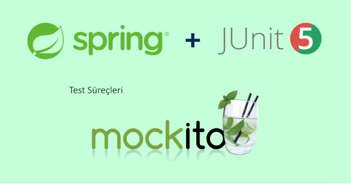

-----
**Unit Test ve Integration Test Kavramları**

**Test yazarken, genellikle iki tür test kullanırız:** Unit Test ve Integration Test. 🛠️ Bu test türleri, uygulamanın farklı katmanlarını test etmek için kullanılır.

**Unit Test (Birim Testi):** Birim testleri, uygulamanın en küçük parçalarını (örneğin, bir metot veya sınıf) test eder. Bu testler, diğer bileşenlerden bağımsız olarak çalışır. Örneğin, bir servis metodu veya bir utility sınıfı için unit test yazabiliriz.

**Integration Test (Entegrasyon Testi):** Entegrasyon testleri, uygulamanın farklı bileşenlerinin birlikte çalışıp çalışmadığını test eder. Örneğin, bir controller'ın service ve repository katmanlarıyla doğru bir şekilde entegre olup olmadığını kontrol eder.

**JUnit ve Mockito ile Test Yazma**

Spring Boot'ta test yazmak için en sık kullanılan kütüphaneler JUnit ve Mockito'dur. 🧪 JUnit, testleri yazmak ve çalıştırmak için kullanılırken, Mockito ise test sırasında mock (sahte) nesneler oluşturmak için kullanılır.

Öncelikle, pom.xml dosyasına test bağımlılıklarını ekleyelim:

```xml
<dependency>
    <groupId>org.springframework.boot</groupId>
    <artifactId>spring-boot-starter-test</artifactId>
    <scope>test</scope>
</dependency>
```

Bu bağımlılık, JUnit, Mockito ve Spring Boot Test kütüphanelerini projemize ekler.

Şimdi, bir unit test örneği yazalım. Örneğin, bir Calculator sınıfı için unit test yazalım:

```java
package tr.com.huseyinaydin.service;

import org.junit.jupiter.api.Test;
import static org.junit.jupiter.api.Assertions.assertEquals;

public class CalculatorTest {

    @Test
    public void testAdd() {
        Calculator calculator = new Calculator();
        assertEquals(5, calculator.add(2, 3));
    }

    @Test
    public void testSubtract() {
        Calculator calculator = new Calculator();
        assertEquals(1, calculator.subtract(3, 2));
    }
}
```

Bu örnekte, Calculator sınıfının add ve subtract metodlarını test ediyoruz. assertEquals metodu, beklenen sonuç ile gerçek sonucu karşılaştırır.

**Mockito ile Mock Nesneler Oluşturma**

Mockito, test sırasında mock (sahte) nesneler oluşturmak için kullanılır. 🎭 Bu sayede, test edilen sınıfın bağımlılıklarını kontrol edebiliriz. Örneğin, bir servis sınıfı için mock repository oluşturabiliriz.

**İşte örnek bir servis sınıfı ve testi:**

```java
package tr.com.huseyinaydin.service;

import tr.com.huseyinaydin.model.Product;
import tr.com.huseyinaydin.repository.ProductRepository;
import org.junit.jupiter.api.Test;
import org.junit.jupiter.api.extension.ExtendWith;
import org.mockito.InjectMocks;
import org.mockito.Mock;
import org.mockito.junit.jupiter.MockitoExtension;
import java.util.Optional;
import static org.junit.jupiter.api.Assertions.assertEquals;
import static org.mockito.Mockito.when;

@ExtendWith(MockitoExtension.class)
public class ProductServiceTest {

    @Mock
    private ProductRepository productRepository;

    @InjectMocks
    private ProductService productService;

    @Test
    public void testGetProductById() {
        Product product = new Product();
        product.setId("1");
        product.setName("Ürün 1");
        product.setPrice(100.0);

        when(productRepository.findById("1")).thenReturn(Optional.of(product));

        Product result = productService.getProductById("1");
        assertEquals("Ürün 1", result.getName());
    }
}
```

**Bu örnekte:**

**@Mock:** ProductRepository için mock nesne oluşturur.

**@InjectMocks:** ProductService sınıfını oluşturur ve mock repository'yi enjekte eder.

when(...).thenReturn(...): Mock repository'nin davranışını belirler.

-----
**Spring Boot Test Kütüphanesi ve Kullanımı**

Spring Boot Test kütüphanesi, entegrasyon testleri yazmak için kullanılır. 🧪 Bu kütüphane, Spring context'ini başlatır ve test sırasında gerçek bileşenleri kullanır.

Öncelikle, bir entegrasyon testi yazalım. Örneğin, bir controller için entegrasyon testi yazalım:

```java
package tr.com.huseyinaydin.controller;

import org.junit.jupiter.api.Test;
import org.springframework.beans.factory.annotation.Autowired;
import org.springframework.boot.test.autoconfigure.web.servlet.AutoConfigureMockMvc;
import org.springframework.boot.test.context.SpringBootTest;
import org.springframework.test.web.servlet.MockMvc;
import static org.springframework.test.web.servlet.request.MockMvcRequestBuilders.get;
import static org.springframework.test.web.servlet.result.MockMvcResultMatchers.status;

@SpringBootTest
@AutoConfigureMockMvc
public class ProductControllerIntegrationTest {

    @Autowired
    private MockMvc mockMvc;

    @Test
    public void testGetProduct() throws Exception {
        mockMvc.perform(get("/api/products/1")).andExpect(status().isOk());
    }
}
```

**Bu örnekte:**

**@SpringBootTest:** Spring context'ini başlatır.

**@AutoConfigureMockMvc:** MockMvc nesnesini oluşturur.

```
mockMvc.perform(...): HTTP isteği gönderir ve sonucu kontrol eder.
```

**Test Yazmanın Avantajları**

**Hata Tespiti:** Testler, kodun doğru çalıştığını ve beklenen sonuçları verdiğini doğrular.

**Güvenilirlik:** Testler, uygulamanın güvenilirliğini artırır ve hataları önceden tespit eder.

**Refactoring:** Testler, kodun yeniden düzenlenmesini (refactoring) kolaylaştırır.

**Dokümantasyon:** Testler, uygulamanın nasıl çalıştığını gösteren bir tür dokümantasyon sağlar.

**16. Spring Boot'ta Performans Optimizasyonu**

Spring Boot uygulamalarında performans optimizasyonu, uygulamanın hızlı ve verimli çalışmasını sağlamak için hayati öneme sahiptir. 🚀 Özellikle büyük ölçekli uygulamalarda, performans sorunları kullanıcı deneyimini olumsuz etkileyebilir. Peki, Spring Boot'ta performans optimizasyonu nasıl yapılır? Hadi adım adım inceleyelim. 👇

-----
**Spring Boot Uygulamalarında Performans Analizi**

|Performans optimizasyonu yapmadan önce, uygulamanın performansını analiz etmek gerekir. 🧐 Bu analiz, uygulamanın yavaşlayan noktalarını ve performans darboğazlarını tespit etmek için kullanılır.||
| :- | :- |

Spring Boot'ta performans analizi yapmak için birçok araç ve yöntem vardır. 

**İşte en popüler olanları:**

**Actuator Endpoint'leri:** Spring Boot Actuator, uygulamanın sağlık durumu, metrikler ve performans bilgilerini sunar. Örneğin, /actuator/metrics endpoint'i, uygulamanın çeşitli metriklerini gösterir.

**Profiling Araçları:** Profiling araçları, uygulamanın çalışma sırasında hangi metodların ne kadar süre harcadığını analiz eder. Örneğin, JProfiler ve VisualVM gibi araçlar kullanılabilir.

**Loglama:** Loglar, uygulamanın performansını izlemek ve yavaşlayan noktaları tespit etmek için kullanılır. Örneğin, bir metodun çalışma süresini loglayabiliriz.

Örnek bir loglama yapalım:

```java
package tr.com.huseyinaydin.service;

import org.slf4j.Logger;
import org.slf4j.LoggerFactory;
import org.springframework.stereotype.Service;

@Service
public class ProductService {

    private static final Logger logger = LoggerFactory.getLogger(ProductService.class);

    public void processProducts() {
        long startTime = System.currentTimeMillis();
        // Ürün işleme kodları
        long endTime = System.currentTimeMillis();
        logger.info("Ürün işleme süresi: {} ms", endTime - startTime);
    }
}
```

Bu örnekte, processProducts metodunun çalışma süresini logluyoruz. 🕒

-----
**Caching Mekanizmaları ve Spring Cache**

Caching (önbellekleme), uygulamanın performansını artırmak için sık kullanılan verileri bellekte tutar. 🚀 Bu sayede, her seferinde veritabanına gitmek yerine, verilere hızlıca erişebiliriz.

Spring Boot'ta caching yapmak için Spring Cache modülünü kullanırız. Öncelikle, pom.xml dosyasına caching bağımlılığını ekleyelim:

```xml
<dependency>
    <groupId>org.springframework.boot</groupId>
    <artifactId>spring-boot-starter-cache</artifactId>
</dependency>
```

Daha sonra, **@EnableCaching** anotasyonu ile caching'i etkinleştirelim:

```java
package tr.com.huseyinaydin.config;

import org.springframework.cache.annotation.EnableCaching;
import org.springframework.context.annotation.Configuration;

@Configuration
@EnableCaching
public class CacheConfig {

}
```

Şimdi, bir servis sınıfında caching kullanalım:

```java
package tr.com.huseyinaydin.service;

import org.springframework.cache.annotation.Cacheable;
import org.springframework.stereotype.Service;
import tr.com.huseyinaydin.model.Product;
import tr.com.huseyinaydin.repository.ProductRepository;
import java.util.List;

@Service
public class ProductService {

    private final ProductRepository productRepository;

    public ProductService(ProductRepository productRepository) {
        this.productRepository = productRepository;
    }

    @Cacheable(value = "products")
    public List<Product> getAllProducts() {
        return productRepository.findAll();
    }
}
```

Bu örnekte, **@Cacheable** anotasyonu ile getAllProducts metodunun sonucunu önbelleğe alıyoruz. Yani, bu metod ilk çağrıldığında veritabanından verileri çeker ve önbelleğe alır. Sonraki çağrımlarda ise veriler önbellekten okunur. 🎉

-----
**Spring Boot'ta Performans İyileştirme Teknikleri**

Spring Boot uygulamalarında performansı artırmak için birçok teknik kullanılabilir. İşte en popüler olanları:

**Veritabanı Optimizasyonu:** Veritabanı sorgularını optimize etmek, performansı önemli ölçüde artırır. Örneğin, gereksiz sorguları azaltmak, indeksleri kullanmak ve sorguları önbelleğe almak gibi teknikler kullanılabilir.

**Asenkron İşlemler:** Uzun süren işlemleri asenkron olarak çalıştırmak, uygulamanın performansını artırır. Spring Boot'ta @Async anotasyonu ile asenkron işlemler yapılabilir.

**Örnek bir asenkron işlem:**

```java
package tr.com.huseyinaydin.service;

import org.springframework.scheduling.annotation.Async;
import org.springframework.stereotype.Service;

@Service
public class NotificationService {

    @Async
    public void sendNotification(String message) {
        // Uzun süren bildirim gönderme işlemi
        System.out.println("Bildirim gönderildi: " + message);
    }
}
```

Bu örnekte, sendNotification metodu asenkron olarak çalışır. 🚀

**Connection Pooling:** Veritabanı bağlantılarını yönetmek için connection pooling kullanılabilir. Örneğin, HikariCP gibi bir connection pool kütüphanesi kullanılabilir.

**Garbage Collection Optimizasyonu:** Java uygulamalarında garbage collection (çöp toplama) performansı etkileyebilir. Garbage collection ayarlarını optimize etmek, uygulamanın performansını artırır.

**CDN Kullanımı:** Statik dosyaları (CSS, JS, resimler) bir CDN (Content Delivery Network) üzerinden sunmak, uygulamanın performansını artırır.

**Performans Optimizasyonunun Avantajları**

**Hızlı Yanıt Süreleri:** Optimizasyon, uygulamanın yanıt sürelerini kısaltır ve kullanıcı deneyimini artırır.

**Kaynak Tasarrufu:** Optimizasyon, CPU, bellek ve ağ kaynaklarını daha verimli kullanır.

**Ölçeklenebilirlik:** Optimizasyon, uygulamanın daha fazla kullanıcıyı desteklemesini sağlar.

**Güvenilirlik:** Optimizasyon, uygulamanın daha kararlı ve güvenilir çalışmasını sağlar.

**17. Spring Boot ve Mikroservis Mimarisi**

Mikroservis mimarisi, modern yazılım geliştirme dünyasında adeta bir devrim yarattı. 🏗️ Özellikle büyük ve karmaşık uygulamaları küçük, bağımsız ve ölçeklenebilir servislere bölmek, hem geliştirme sürecini kolaylaştırır hem de uygulamanın bakımını daha yönetilebilir hale getirir. Peki, mikroservis mimarisi tam olarak nedir ve Spring Boot ile nasıl uygulanır? Hadi adım adım inceleyelim. 👇

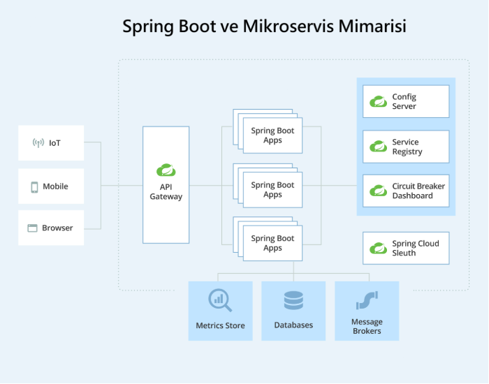

-----
**Mikroservis Nedir ve Spring Boot ile Nasıl Uygulanır?**

Mikroservis mimarisi, bir uygulamayı küçük, bağımsız ve birbirleriyle iletişim kurabilen servislere bölme yaklaşımıdır. 🧩 Her mikroservis, belirli bir işlevi yerine getirir ve kendi veritabanına sahip olabilir. Bu sayede, uygulamanın farklı bölümleri bağımsız olarak geliştirilebilir, test edilebilir ve dağıtılabilir.

Spring Boot, mikroservis mimarisi için harika bir seçenektir. 🚀 Spring Boot'un sunduğu kolay yapılandırma, hızlı başlangıç ve geniş kütüphane desteği, mikroservis geliştirmeyi oldukça kolaylaştırır.

Öncelikle, bir mikroservis projesi oluşturalım. Spring Initializr kullanarak bir Spring Boot projesi oluşturabiliriz. 

```xml
<dependencies>
    <dependency>
        <groupId>org.springframework.boot</groupId>
        <artifactId>spring-boot-starter-web</artifactId>
    </dependency>

    <dependency>
        <groupId>org.springframework.boot</groupId>
        <artifactId>spring-boot-starter-data-jpa</artifactId>
    </dependency>

    <dependency>
        <groupId>org.springframework.cloud</groupId>
        <artifactId>spring-cloud-starter-netflix-eureka-client</artifactId>
    </dependency>
</dependencies>
```

Bu bağımlılıklar, Spring Boot'un web, veritabanı ve Eureka client özelliklerini projemize ekler.

Şimdi, basit bir mikroservis örneği yapalım. Örneğin, bir "Ürün Servisi" oluşturalım:

```java
package tr.com.huseyinaydin.productservice;

import org.springframework.boot.SpringApplication;
import org.springframework.boot.autoconfigure.SpringBootApplication;
import org.springframework.cloud.client.discovery.EnableDiscoveryClient;

@SpringBootApplication
@EnableDiscoveryClient
public class ProductServiceApplication {

    public static void main(String[] args) {
        SpringApplication.run(ProductServiceApplication.class, args);
    }
}
```

Bu sınıf, Spring Boot uygulamasını başlatır ve Eureka client olarak kaydeder. 🖥️

-----
**Spring Cloud ile Mikroservis Mimarisi**

Spring Cloud, mikroservis mimarisi için gerekli birçok özelliği sunar. 🛠️ Özellikle service discovery, API Gateway ve load balancing gibi konularda büyük kolaylık sağlar.

**Spring Cloud'un en popüler modülleri şunlardır:**

**Eureka:** Service discovery için kullanılır.

**Zuul/Spring Cloud Gateway:** API Gateway için kullanılır.

**Ribbon:** Load balancing için kullanılır.

Öncelikle, bir Eureka Server oluşturalım. Eureka Server, mikroservislerin birbirlerini bulmasını sağlar. Örnek bir Eureka Server yapılandırması:

```java
package tr.com.huseyinaydin.eurekaserver;

import org.springframework.boot.SpringApplication;
import org.springframework.boot.autoconfigure.SpringBootApplication;
import org.springframework.cloud.netflix.eureka.server.EnableEurekaServer;

@SpringBootApplication
@EnableEurekaServer
public class EurekaServerApplication {

    public static void main(String[] args) {
        SpringApplication.run(EurekaServerApplication.class, args);
    }
}
```

Bu sınıf, Eureka Server'ı başlatır. 🚀

-----
**Service Discovery, API Gateway ve Load Balancing**

Mikroservis mimarisinde, servislerin birbirlerini bulması (service discovery), dış dünyaya tek bir noktadan erişim sağlanması (API Gateway) ve yük dağıtımı (load balancing) önemli konulardır. 🛡️

**Service Discovery:** Mikroservisler, birbirlerini bulmak için Eureka gibi bir service discovery mekanizması kullanır. Örneğin, bir "Sipariş Servisi", "Ürün Servisi"ni Eureka üzerinden bulabilir.

**API Gateway:** API Gateway, dış dünyaya tek bir noktadan erişim sağlar. Örneğin, Spring Cloud Gateway veya Zuul kullanılabilir. API Gateway, gelen istekleri ilgili mikroservise yönlendirir.

**Örnek bir Spring Cloud Gateway yapılandırması:**

```java
spring:
  cloud:
    gateway:
      routes:
        - id: product-service
          uri: lb://PRODUCT-SERVICE
          predicates:
            - Path=/products/\*\*
```

Bu yapılandırma, /products/\*\* endpoint'lerini PRODUCT-SERVICE mikroservisine yönlendirir. 🚀

**Load Balancing:** Load balancing, gelen istekleri farklı mikroservis örneklerine dağıtır. Örneğin, Ribbon kullanılarak load balancing yapılabilir.

**Örnek bir load balancing yapılandırması:**

```java
@Bean
@LoadBalanced
public RestTemplate restTemplate() {
    return new RestTemplate();
}
```

Bu bean, load balancing özelliği etkinleştirilmiş bir RestTemplate oluşturur. 🎯

**Mikroservis Mimarisi Avantajları**

**Ölçeklenebilirlik:** Mikroservisler, bağımsız olarak ölçeklenebilir.

**Esneklik:** Farklı teknolojiler kullanılabilir.

**Hızlı Geliştirme:** Mikroservisler, bağımsız olarak geliştirilebilir ve dağıtılabilir.

**Hata Yalıtımı:** Bir mikroserviste oluşan hata, diğerlerini etkilemez.
# **18. Spring Boot ve Docker**
## **Docker Nedir ve Spring Boot Uygulamaları Nasıl Containerize Edilir?**
Docker, uygulamaları ve bağımlılıklarını hafif, taşınabilir konteynerlerde çalıştıran bir sanallaştırma platformudur. Geleneksel sunucu tabanlı yaklaşımlardan farklı olarak, Docker her bir uygulama için izole bir ortam sağlar. Bu sayede "bende çalışıyordu ama senin ortamında çalışmıyor" gibi sorunları ortadan kaldırır. 😃

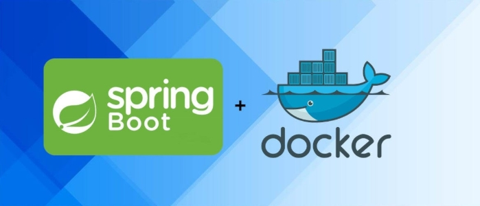

Spring Boot ile Docker entegrasyonu, uygulamaları hızla dağıtılabilir ve ölçeklenebilir hale getirir. Öncelikle basit bir Dockerfile oluşturarak bir Spring Boot uygulamasını nasıl containerize edebileceğimize bakalım.

**Dockerfile Oluşturma**

**Örnek olarak tr.com.huseyinaydin paket ismiyle oluşturduğumuz basit bir Spring Boot uygulamasını Docker'a hazırlayalım:**

```
\# OpenJDK 17 tabanlı bir image kullanıyoruz
FROM openjdk:17-jdk-slim
\# Uygulama JAR dosyasını container içine kopyalıyoruz
COPY target/myapp.jar /app.jar
\# Container çalıştırıldığında JAR dosyasını başlatıyoruz
ENTRYPOINT ["java", "-jar", "/app.jar"]
```

**Daha sonra aşağıdaki komutlarla Docker image'ını oluşturup çalıştırabiliriz:**

```
\# Docker image'ı oluştur
docker build -t my-springboot-app .
\# Container olarak çalıştır
docker run -p 8080:8080 my-springboot-app
```

**Docker Compose Kullanımı**

Docker Compose, birden fazla servisi yönetmek için kullanılan bir araçtır. Özellikle veritabanı + backend gibi bağımlı servisleri tek bir yapı içinde çalıştırmak için kullanışlıdır. Örneğin, PostgreSQL ile çalışan bir Spring Boot uygulaması için docker-compose.yml dosyamızı oluşturalım:

```
version: '3.8'
services:
  database:
    image: postgres:14
    environment:
      POSTGRES_USER: admin
      POSTGRES_PASSWORD: toor
      POSTGRES_DB: huseyin_aydin_db
    ports:
      - "5432:5432"
  app:

    build: .
    ports:
      - "8080:8080"
    depends_on:
      - database
```

**Bu yapı sayesinde tek bir komutla hem PostgreSQL hem de Spring Boot uygulamamızı ayağa kaldırabiliriz:**

**docker-compose up -d**

Bu kadar basit! Artık veritabanı ve backend servisi Docker içinde birlikte çalışıyor. 🚀

-----
**19. Spring Boot'ta Monitoring ve Management**

**Actuator ile Uygulama Sağlığı ve Metriklerin İzlenmesi**

Spring Boot Actuator, uygulama hakkında önemli bilgileri sağlar. Uygulama sağlığı, metrikler, çevresel değişkenler gibi detayları görmek için Actuator kullanabiliriz.

**Başlangıç olarak pom.xml dosyamıza Actuator bağımlılığını ekleyelim:**

```xml
<dependency>
    <groupId>org.springframework.boot</groupId>
    <artifactId>spring-boot-starter-actuator</artifactId>
</dependency>
```

**Daha sonra application.properties dosyamızda bazı endpoint'leri açalım:**

management.endpoints.web.exposure.include=health,info,metrics

**Şimdi Spring Boot uygulamamızı çalıştırdıktan sonra aşağıdaki endpoint'leri kontrol edebiliriz:**

- http://localhost:8080/actuator/health → Uygulamanın sağlığını gösterir.
- http://localhost:8080/actuator/metrics → Kullanılabilir metrikleri listeler.

**Prometheus ve Grafana ile Monitoring**

|<p>Actuator verilerini Prometheus ve Grafana gibi araçlarla daha görselleştirilmiş bir şekilde izleyebiliriz. Prometheus, uygulamadan veri toplarken, Grafana bu verileri gösterir. </p><p></p>|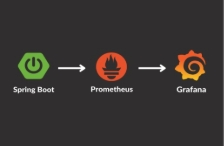|
| :- | :- |

**Örnek bir prometheus.yml yapılandırması şu şekilde olabilir:**

```
scrape_configs:
  - job_name: 'spring-boot-app'
    metrics_path: '/actuator/prometheus'
    static_configs:
      - targets: ['host.docker.internal:8080']
```

**Docker üzerinden Prometheus ve Grafana'yı ayağa kaldırmak için şu komutları kullanabiliriz:**

```
**docker run -d --name prometheus -p 9090:9090 -v $(pwd)/prometheus.yml:/etc/prometheus/prometheus.yml prom/prometheus**

**docker run -d --name grafana -p 3000:3000 grafana/grafana**
```

**Daha sonra Grafana arayüzünden Prometheus'u veri kaynağı olarak ekleyerek izlemeye başlayabiliriz! 🎯**

-----
**20. Spring Boot ve Cloud Entegrasyonu**

Spring Boot'un Cloud desteği sayesinde uygulamalarımızı AWS, Azure veya Google Cloud gibi ortamlara kolayca taşıyabiliriz. Burada Spring Cloud çözümlerine göz atalım.

**Spring Cloud Config ile Merkezi Yapılandırma Yönetimi**

Spring Cloud Config, konfigürasyonları merkezi olarak yönetmemizi sağlar. Özellikle mikroservis tabanlı mimarilerde her servisin ayrı ayrı yapılandırma dosyaları yerine merkezi bir konfigürasyon sunucusu kullanmasını sağlar. Örneğin:

```
server.port=8888
spring.application.name=config-server
spring.cloud.config.server.git.uri=https://github.com/kullanici/repo.git
```

**Uygulama başladığında konfigürasyonları merkezi bir Git deposundan çeker. 🚀**

-----
**21. Spring Boot'ta Gelişmiş Konular**

Spring Boot ile reaktif programlama, GraphQL ve WebSocket gibi modern teknolojileri kullanabiliriz.

**Reactive Programming ve Spring WebFlux**

Spring WebFlux, reaktif programlamaya olanak tanır. Geleneksel @RestController yerine @Controller ve Flux/Mono kullanarak bloklamayan (non-blocking) çağrılar yapabiliriz:

```java
@RestController
public class ReactiveController {

    @GetMapping("/numbers")
    public Flux<Integer> getNumbers() {
        return Flux.range(1, 10).delayElements(Duration.ofSeconds(1));
    }
}
```

**Bu endpoint, her saniyede bir sayı döndürerek reaktif bir akış oluşturur. 🎉**

-----
**22. Spring Boot'un Geleceği ve Trendler**

Spring Boot her geçen gün gelişiyor. 🚀 Yapay zeka entegrasyonları, mikroservis mimarilerindeki yenilikler, performans iyileştirmeleri gibi konular gelecekte daha da önemli hale gelecek.

Özellikle GraalVM desteği ile daha hızlı başlatma süreleri ve düşük bellek kullanımı sağlanacak. Yapay zeka destekli uygulamalar da Spring Boot ile daha entegre hale gelecek.

**Gelecek parlak görünüyor! 🌟**

**Hüseyin AYDIN**

**Saygılarımla…**


